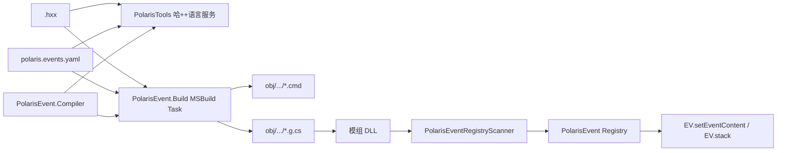

# PolarisEvent（哈++实现库）实施计划

> 扫描基线：`E:\Projects\Polaris` 与同级 `E:\Projects\PolarisTools`，2026-08-12。  
> 本文只定义实施方案，尚未修改运行时代码、VSIX 或构建链。
>
> **勘误（2026-08-12，阶段4实测后）**：本文下面所有 `.hxx` 均已作废，实际扩展名是 `.phxx`。
> 原因：装了 C++ 工作负载的 Visual Studio 会把 `.hxx` 强关联到内置 C/C++ 语言服务（legacy
> `IVsLanguageInfo` 注册，优先级高于本文 §6.1 设想的 MEF 内容类型/`FileExtensionToContentTypeDefinition`），
> 哈++编辑器的语法高亮和实时诊断因此永远抢不过原生 C/C++ 着色器，实测中新扩展装上后高亮和波浪线
> 完全不生效。代码、模板、MSBuild 通配符已经全部改成 `.phxx`；本文正文未逐处替换，读到 `.hxx` 时
> 按 `.phxx` 理解即可。

## 1. 目标流程

最终用户流程应当是：

1. 安装 PolarisTools VSIX。
2. 在 C# 模组项目中选择“添加 → 新建项 → Polaris Event（哈++）”，创建 `.hxx` 文件；第一次创建时可同时生成项目级别名文件。
3. 使用 Visual Studio 原生文本编辑器打开 `.hxx`：立即获得语法高亮、错误波浪线、错误列表、悬停说明和基础补全。
4. 保存不是构建的必要条件；`Build/Rebuild` 时 MSBuild 权威地把所有 `.hxx` 编译为：
   - `obj/.../PolarisEvent/**/*.cmd`：供检查和调试的底层哈语言；
   - `obj/.../PolarisEvent/**/*.g.cs`：把 CMD、标识和元数据嵌进模组程序集的自动注册类。
5. 模组 DLL 被 BepInEx 加载后，PolarisEvent 扫描生成类并完成注册。
6. 游戏内可用强类型生成入口或字符串 ID 调用：

```csharp
GeneratedEvents.MuseumEntrance.Start();

// 或动态调用
PolarisEvent.Start("MuseumEntrance");
```

7. PolarisEvent 把已注册 CMD 注入游戏 `EV` 内容表，并通过 `EV.stack(..., args, ...)` 启动；事件结束、回调和当前事件状态继续复用现有 `GameEvent` 能力层。

## 2. 当前结构扫描结论

### 2.1 Polaris 已有的可复用基础

| 现有位置 | 已有能力 | 对 PolarisEvent 的作用 |
| --- | --- | --- |
| `Api/Game/PolarisGameAPI.cs` | `PolarisAPI.Game.Events.Start/Change/Current` | 提供原生事件启动与当前事件 API 基线 |
| `Api/Game/GameEvent.cs` | 活动事件包装、停止、消息状态、事件内容读写 | PolarisEvent 启动后仍返回该实例类型 |
| `Api/Game/Internal/GameEventRuntime.cs` | 对当前事件进行记账 | 不必另造第二套当前事件状态 |
| `Patch/Callbacks/UiAndEventCallbackPatches.cs` | 已补丁 `EV.stack/changeEvent/evEnd` | 生成事件天然进入现有 opened/closed 回调链 |
| `Lang/PlangRegistryScanner.cs` | “生成类特性 + 扫描 + 无参构造 + 注册”模式 | PolarisEvent 注册扫描器可沿用其生命周期与隔离策略 |
| `PUI/PUIManager.cs` | 全域特性扫描、重名检查、子系统初始化 | 可参考目录、冲突和失败隔离设计 |
| `Infra/ModulesAPI.cs` / `TypesAPI` | 已加载插件程序集及缓存类型扫描 | 无需自己遍历 AppDomain 与处理 ReflectionTypeLoadException |
| `Diagnostics` / `PolarisAPI.Errors` | 错误归因、报告、致命冲突 | 处理事件 ID 冲突、注入失败和启动失败 |
| `Res` | 模组资源挂载与自动扫描 | 后续可为别名资源校验提供目录和资源目录信息 |

现有事件入口有两个需要在实现时补强：

- `Game.Events.Start` 当前调用 `EV.stack` 后没有检查返回的 `EvReader` 是否为空；PolarisEvent 不应复制这个行为。
- `Game.Events.Start/Change` 当前没有暴露事件参数；哈++的 `@call args:` 和生成入口需要把 `string[]` 传入 `EV.stack`。

### 2.2 PolarisTools 已有的可复用基础

| 现有位置 | 已有能力 | 对 PolarisEvent 的作用 |
| --- | --- | --- |
| `ItemTemplates/Polaris/*` | `.pui/.puisln/.plang` 新建项模板 | 增加 `.hxx` 模板和默认别名文件 |
| `PolarisToolsPackage.cs` | VSIX 包、项目项监听、编辑器/生成器注册 | 注册哈++内容类型与模板；监听别名文件变化 |
| `PolarisPuiGenerator` / `PolarisLangGenerator` | 文件解析、C# 生成、错误回报 | 参考代码生成规范和命名空间解析 |
| `source.extension.vsixmanifest` | 已声明 VS Package、MEF Component、Item Templates | 哈++文本语言服务可以直接作为 MEF 组件加入 |
| `Directory.Build.props` | Polaris 与 PolarisTools 并排目录、共享源码链接 | 共享哈++编译器模型或改用 ProjectReference |

当前 PolarisTools **没有**文本语言服务：没有 `IClassifier`、`ITagger<ErrorTag>`、completion source 或哈++ content type。`.pui/.plang` 使用的是专用 WPF 编辑器，不适合直接承载剧本语言的文本编辑体验。

### 2.3 必须规避的现有局限

现有 `.pui/.plang` 使用 VS `IVsSingleFileGenerator`，由“添加/保存文件”触发 CustomTool。这不是可靠的构建系统：

- 命令行 MSBuild 和 CI 不保证运行 VS CustomTool；
- 只改共享别名文件时，不一定重新生成所有依赖它的 `.hxx`；
- 生成文件可能落后于源文件，普通 Build 仍可能成功；
- 编译器逻辑若分别写在编辑器和生成器里会发生诊断漂移。

因此 `.hxx` 不加入现有 `GeneratorBindings`，不把保存时生成当成真相。编辑器只做即时诊断，MSBuild 每次构建执行权威编译。

## 3. 推荐组件边界



### 3.1 `Polaris.Event.Compiler`：共享的纯编译器

新增独立项目，不引用 Unity、BepInEx、游戏程序集或 Visual Studio SDK。

推荐落点：

```text
E:\Projects\Polaris\Polaris.Event.Compiler\
  Polaris.Event.Compiler.csproj
  Syntax\
  Parsing\
  Binding\
  Aliases\
  Lowering\
  Emission\
  Diagnostics\
  SourceMaps\
```

目标框架建议 `netstandard2.0`，保证：

- PolarisTools 的 `net472` VSIX 能直接引用；
- MSBuild task 和测试项目可引用；
- 不把编译器代码装进游戏运行时 DLL。

公开入口建议只有：

```csharp
HppParseResult Parse(SourceText source);
HppAnalysisResult Analyze(HppProject project, CancellationToken token);
HppCompileResult Compile(HppProject project, CancellationToken token);
```

三条调用路径必须共用这些 API：编辑器实时诊断、MSBuild 构建、测试/CLI。

### 3.2 `Polaris.Event.Build`：权威构建集成

新增项目：

```text
E:\Projects\Polaris\Polaris.Event.Build\
  Polaris.Event.Build.csproj
  PolarisEventCompileTask.cs
  buildTransitive\Polaris.Event.Build.props
  buildTransitive\Polaris.Event.Build.targets
```

职责：

- 收集项目内的 `.hxx` 与 `polaris.events.yaml`；
- 在 `CoreCompile` 前调用共享编译器；
- 把 `.g.cs` 加入 `Compile`；
- 把 `.cmd` 和 `.hmap.json` 写入 `obj`；
- 使用 MSBuild 的文件、行、列诊断接口写入 Error List；
- 实现增量构建、确定性排序和 write-if-changed；
- `Clean` 只清理自己的 `obj/.../PolarisEvent` 目录。

推荐项目属性：

```xml
<PropertyGroup>
  <PolarisEventNamespace>com.example.mymod</PolarisEventNamespace>
  <PolarisEventTarget>0.29j</PolarisEventTarget>
  <PolarisEventAliasFile>Events\polaris.events.yaml</PolarisEventAliasFile>
</PropertyGroup>
```

推荐 Item：

```xml
<ItemGroup>
  <PolarisEvent Include="Events\**\*.hxx" />
</ItemGroup>
```

若没有显式 Item，`.targets` 可把项目目录内 `**/*.hxx` 作为默认输入；显式 Item 优先，便于排除测试素材。

### 3.3 `Polaris.Event`：Polaris 游戏侧运行时

保持 Polaris “一个运行时 DLL”原则：实现位于当前 `Polaris.dll`，公开命名空间使用 `Polaris.Event`，而不是要求玩家再安装一个易缺失的运行时 DLL。

推荐落点：

```text
E:\Projects\Polaris\Event\
  PolarisEvent.cs
  PolarisEventId.cs
  PolarisEventDefinition.cs
  PolarisEventReference.cs
  IPolarisEventRegistrar.cs
  PolarisEventAutoRegistrationAttribute.cs
  PolarisEventRegistry.cs
  PolarisEventRegistryScanner.cs
  PolarisEventRuntime.cs
  PolarisEventConflictGuard.cs
  PolarisEventSettings.cs
```

核心职责：

- 接收生成类注册的事件定义；
- 按程序集/BepInEx 插件归属记录 owner；
- 拒绝事件 ID 冲突；
- 使用保留内存事件键把 CMD 注入 `EV`；
- 提供 `Start/Change/TryStart/IsRegistered/Get`；
- 把启动错误交给 `PolarisAPI.Errors`；
- 与现有 `GameEventRuntime` 和回调体系衔接。

## 4. 事件 ID、生成产物与注册协议

### 4.1 稳定事件 ID

源文件中的逻辑 ID 示例：

```text
Museum/Entrance
```

运行时键必须带模组命名空间：

```text
%polaris/com.example.mymod/Museum/Entrance
```

选择 `%` 前缀的原因：现有事件文档确认 `%` 是保留/内存事件惯例，`EV.clearEventContent()` 清理普通缓存时会跳过它。

约束：

- `PolarisEventNamespace` 必填，不允许默认为程序集短名后静默发布；
- 文件相对路径默认成为事件 ID，可用文件头显式覆盖；
- 比较采用 ordinal ignore-case 还是 ordinal 必须在 v1 冻结；建议 ordinal ignore-case，与作者侧命令和别名体验一致；
- 冲突视为致命错误，报告双方程序集、源文件、逻辑 ID 和运行时键。

### 4.2 构建输出

对于：

```text
Events/Museum/Entrance.hxx
```

生成：

```text
obj/<Configuration>/<TFM>/PolarisEvent/Museum/Entrance.cmd
obj/<Configuration>/<TFM>/PolarisEvent/Museum/Entrance.hmap.json
obj/<Configuration>/<TFM>/PolarisEvent/Museum/Entrance.g.cs
```

`.cmd` 默认不复制到 `bin`，因为真正运行内容已嵌入 `.g.cs`。提供：

```xml
<PolarisEventEmitCmd>true</PolarisEventEmitCmd>
```

用于调试时把 CMD 额外复制到输出目录；发布默认关闭，避免 DLL 内嵌内容和外部文件出现双重真相。

### 4.3 自动生成 C# 形态

概念输出：

```csharp
// <auto-generated />
namespace MyMod.Generated.Events;

[global::Polaris.Event.PolarisEventAutoRegistration]
public sealed class Museum_Entrance_Registrar
    : global::Polaris.Event.IPolarisEventRegistrar
{
    public void Register(global::Polaris.Event.PolarisEventRegistrationContext context)
    {
        context.Register(
            logicalId: "Museum/Entrance",
            commandText: "TALKER n L\nPIC n ...\n...",
            sourcePath: "Events/Museum/Entrance.hxx",
            contentHash: "...");
    }
}

public static class GeneratedEvents
{
    public static global::Polaris.Event.PolarisEventReference Museum_Entrance { get; }
        = new("com.example.mymod", "Museum/Entrance");
}
```

不要让生成类直接调用内部 registry。扫描器向 registrar 传入带 owner 的 registration context，可避免生成代码伪造其它程序集的归属。

## 5. 游戏侧注册与调用时序

### 5.1 初始化顺序

在 `Plugin.Start()` 中加入独立子系统：

```text
resource → localization → PolarisEvent → PUI → settings
```

PolarisEvent 不依赖 PUI；若别名将来引用 PolarisRes 的模组资源，则保留在 Res 之后初始化。

扫描规则仿照 Plang：

1. 使用 `PolarisAPI.Types.InPluginsWith<PolarisEventAutoRegistrationAttribute>()`。
2. 仅接受非抽象、公开、实现 `IPolarisEventRegistrar` 且具有公开无参构造函数的类。
3. 每个 registrar 单独捕获异常，失败不阻断其它模组注册。
4. 扫描结束统一 seal 冲突；事件 ID 冲突为致命错误。

### 5.2 注入 EV 的时机

注册和注入必须分开：Polaris `Start()` 扫描时，原生 EV 的内容表不一定已经完成初始化。

推荐流程：

- 注册阶段只把 `PolarisEventDefinition` 放入 Polaris 自己的 registry；
- `PolarisEvent.Start` 在调用 `EV.stack` 前执行 `EnsureInstalled(definition)`；
- 可选在确认 `EV.loadEV/initEvent` 完成后的补丁点批量预安装，保证生成 CMD 内部的 `CHANGE_EVENT2 %polaris/...` 可直接找到其它已注册事件；
- 注入使用 `EV.setEventContent(runtimeKey, commandText)`；
- `%polaris/...` 被注入后通常不会被 `clearEventContent()` 清理，但仍要为游戏版本变化准备重新安装钩子。

第一阶段必须用反编译/运行测试确认 `EV.loadEV`、`EV.initEvent` 和 `setEventContent` 的安全调用窗口，不应仅凭静态字段当前是否为 null 猜测。

### 5.3 公开调用 API

```csharp
public static class PolarisEvent
{
    public static bool IsRegistered(string logicalId);
    public static PolarisEventReference Get(string logicalId);
    public static GameEvent Start(string logicalId, params string[] args);
    public static bool TryStart(string logicalId, out GameEvent gameEvent, params string[] args);
    public static GameEvent Change(string logicalId, params string[] args);
}
```

`PolarisEventReference` 同样提供 `Start/Change`，供生成的强类型入口使用。

启动必须：

1. 解析调用方命名空间或使用 reference 中已固定的 owner；
2. 查 registry；
3. 确保全部相关事件内容已安装；
4. 调用 `EV.stack(runtimeKey, 0, -1, args, null)`；
5. 检查返回 `EvReader` 非空；
6. 仅在成功后调用 `EV.evStart()`；
7. 返回现有 `GameEvent` 包装器。

## 6. PolarisTools 编辑体验

### 6.1 使用原生文本编辑器，不新增 WPF 文档窗格

新增：

```text
E:\Projects\PolarisTools\Event\Language\
  HppContentType.cs
  HppClassifier.cs
  HppClassifierProvider.cs
  HppClassificationFormats.cs
  HppDiagnosticTagger.cs
  HppDiagnosticTaggerProvider.cs
  HppErrorTableSource.cs
  HppQuickInfoSource.cs
  HppCompletionSource.cs        # 第二阶段
  HppWorkspaceService.cs
```

通过 MEF 导出 `.hxx` content type 和文件扩展映射。VSIX manifest 已经包含 `Microsoft.VisualStudio.MefComponent`，无需把 `.hxx` 注册成 `ProvideEditorExtension` 并覆盖原生文本编辑器。

### 6.2 语法高亮范围

至少提供：

- `@command`：关键字；
- `# Label`：标签；
- `; comment`：注释；
- `Actor.Pose:`：角色与姿势两种分类；
- `key:`：参数名；
- `flag!`：布尔标记；
- 字符串、数值、颜色、`{variable}` 和表达式；
- 缩进块引导线可后置，不属于 MVP。

高亮只依赖 lexer，保证每次键入都足够快；语义别名颜色和错误由异步分析层补充。

### 6.3 实时错误

`HppWorkspaceService` 按项目缓存：

- 当前 `.hxx` 文本快照；
- 项目级 aliases；
- 其它事件 ID/标签索引；
- 最近一次诊断结果。

触发条件：

- buffer 改变后 200–300ms debounce；
- alias 文件保存/磁盘变化；
- 项目项增加、删除、重命名；
- 配置属性变化后重新加载项目。

输出两路：

- `ITagger<ErrorTag>`：编辑器波浪线；
- Error List table source：文件、行、列、`HPPxxxx`、错误文本，可双击跳转。

编译器诊断必须含稳定代码、severity、source span 和 related location。典型错误：未知命令、姿势拼写、缺少主参数、未定义别名、重复事件 ID、无效标签、缩进错误、不支持的底层降级。

### 6.4 新建项模板

新增：

```text
ItemTemplates/Polaris/EventFile/
  EventFile.vstemplate
  Template.hxx
ItemTemplates/Polaris/EventAliases/
  EventAliases.vstemplate
  polaris.events.yaml
```

更新：

- `PolarisTools.csproj` 的 `VSIXSourceItem`；
- `source.extension.vsixmanifest` 的 ItemTemplate asset。

默认 `.hxx` 内容：

```hxx
; Polaris Event / 哈++
@char Noel.Normal pos:left
Noel: 你好。
@return
```

如果项目没有构建集成，编辑器显示一条可操作通知“启用 PolarisEvent 构建支持”。不要像当前 `.pui` 一样给 `.hxx` 设置 CustomTool；启用操作应添加稳定的 PackageReference/Import 和项目属性。

## 7. 构建集成分发决策

这是实施前必须冻结的唯一产品级决策。

### 推荐：构建包独立、模板自动接入

- PolarisTools VSIX：只负责编辑体验与项目初始化；
- `Polaris.Event.Build`：作为 NuGet/MSBuild 包进入模组项目；
- Polaris：游戏运行时；
- 三者共享 `Polaris.Event.Compiler`，版本必须一致或在文件头/生成元数据中声明兼容版本。

优势：命令行、CI 和没装 VSIX 的构建机也能正确编译。VSIX 路径不会被写进 `.csproj`。

若暂时没有 NuGet 发布流程，可先在仓库中用相对 `ProjectReference + Import` 做 dogfood，但正式发布前必须转为可还原的 build package。

不推荐把编译 target 从 VSIX 安装目录直接 Import：升级 VSIX或换 VS 实例后路径会变化，并且 CI 无法构建。

## 8. 分阶段实施计划

### 阶段 0：运行时可行性验证

任务：

- 用最小硬编码 CMD 调用 `EV.setEventContent("%polaris/test", text)`；
- 在标题、地图加载前后分别测试注入安全窗口；
- 验证 `EV.stack(..., string[] args, ...)` 的 `$1...` 参数行为；
- 验证 `%` 内容经过地图切换、`clearEventContent`、读档后的存活；
- 验证内存事件中的 `CHANGE_EVENT2`、`MODULE` 和预扫描资源行为；
- 记录必须补丁的初始化方法与精确签名。

验收：最小 C# 注册内容可以从游戏内启动、调用第二个内存事件、正确返回，并触发现有 EventOpened/EventClosed 回调。

### 阶段 1：编译器核心与 golden tests

任务：

- 建 `Polaris.Event.Compiler`；
- 实现 lexer、行式 parser、缩进块、AST、诊断模型；
- 实现 aliases 解析与 `Actor.Pose` 绑定；
- 先实现 v2 指令表中的核心 20–30 条；
- 降级为底层命令 IR、CMD 和 source map；
- 建立 golden fixtures：`.hxx + aliases → .cmd + diagnostics`；
- 测试换行、编码、引号、变量插值、重复别名、未知姿势、选择/条件生成标签。

验收：无 VS、无游戏依赖即可执行全部编译测试；相同输入的 CMD 和诊断字节级稳定。

### 阶段 2：Polaris 运行时注册库

任务：

- 增加 `Event/` 运行时类型；
- 增加 registry scanner 和冲突 guard；
- 在 `Plugin.Start` 接入子系统；
- 增加注入时机桥和事件启动 API；
- 增加参数传递；
- 复用 `GameEventRuntime`，不建立重复回调体系；
- README 增加安装和调用示例。

验收：手写 registrar 和嵌入 CMD 可自动注册；重名能准确归因并拦截；强制结束和正常结束回调保持现状。

### 阶段 3：MSBuild 生成链

任务：

- 实现 `PolarisEventCompileTask` 与 props/targets；
- 输出 `.cmd/.hmap.json/.g.cs` 到 `obj`；
- 将 `.g.cs` 加入当前 Compile；
- 生成 registrar 和 `GeneratedEvents`；
- 构建错误进入 Error List；
- 实现增量构建、Clean、并行项目隔离和设计时构建降噪；
- 增加命令行 `dotnet/msbuild` 验证工程。

验收：删除全部生成产物后只运行 MSBuild，仍能生成 C# 并成功编译模组；故意写错 `.hxx` 时构建失败并指向正确行列。

### 阶段 4：PolarisTools 语言服务

任务：

- 增加 `.hxx` content type；
- lexer 高亮；
- 异步 diagnostics tagger；
- Error List data source；
- alias/event workspace cache；
- 新建项模板；
- 安装/启用构建支持的项目提示。

验收：输入未知姿势后 300ms 左右出现波浪线，修正后消失；Build 给出同一诊断代码和位置；高亮不会在大文件中明显阻塞 UI。

### 阶段 5：作者体验完善

任务：

- 命令、角色、姿势、位置、音效和事件 ID 自动补全；
- Quick Info 展示命令参数、默认值与底层展开摘要；
- `Go To Definition` 从 `Noel.Happy` 跳到 aliases；
- Code Action：创建缺失别名、修复拼写、抽取复杂 PIC 串；
- `hppc explain` 或 VS 命令显示选中行生成的 CMD；
- 旧 `.cmd` 迁移器抽取重复 PIC 串并生成别名候选。

验收：常用事件可不查文档完成；脚本正文不出现原始 PIC 组合串、原始等待器键或长事件路径。

### 阶段 6：端到端发布验证

测试矩阵：

- VS 新建、编辑、保存、Build/Rebuild/Clean；
- 命令行 MSBuild 与 CI；
- Debug/Release、多目标框架和两个模组并行构建；
- 两个模组同逻辑 ID 但不同 namespace；同 namespace 冲突；
- 游戏冷启动、地图切换、读档、事件栈嵌套、正常/强制结束；
- `@call`、参数、选择、`WAIT_MOVE/WAIT_FN`；
- 未安装 PolarisEvent 兼容运行时、版本不匹配、注册类构造失败；
- 非 ASCII 台词、路径和换行；
- 生成 CMD 与 source map 的错误反查。

发布门槛：没有 VSIX 的构建机可成功构建；没有 `.hxx/.yaml/.cmd` 运行时文件也可执行嵌入事件；运行错误能明确归因到模组和源 `.hxx`。

## 9. 推荐首批文件改动清单

### Polaris

```text
Polaris.slnx                                      # 加 Compiler/Build/Test 项目
Plugin.cs                                         # InitSubsystem("event", ...)
README.md                                         # PolarisEvent 文档
Event/*.cs                                        # 运行时库
Patch/Event/*.cs                                  # EV 初始化/重新注入（经阶段 0 确认后）
Polaris.Event.Compiler/**/*.cs                    # 共享编译器
Polaris.Event.Compiler.Tests/**/*.cs              # golden/unit tests
Polaris.Event.Build/**/*                          # MSBuild task/targets
```

### PolarisTools

```text
PolarisTools.csproj                               # 引用 Compiler；打包模板/MEF 依赖
PolarisToolsPackage.cs                            # 初始化 workspace 与项目提示
source.extension.vsixmanifest                     # 新 Item Templates
Event/Language/*.cs                               # content type、高亮、诊断、Error List
Event/ProjectSystem/*.cs                          # 配置/alias 定位与启用构建支持
ItemTemplates/Polaris/EventFile/*                 # .hxx 模板
ItemTemplates/Polaris/EventAliases/*              # aliases 模板
```

## 10. 关键风险与控制

| 风险 | 控制 |
| --- | --- |
| 编辑器诊断与构建诊断不一致 | 两者引用同一 Compiler 项目，不复制 parser/schema |
| CustomTool/保存时生成导致陈旧文件 | `.hxx` 权威生成只在 MSBuild；IDE 分析不写 `.g.cs` |
| EV 尚未初始化时注入失败 | registry 与 injection 分离；阶段 0 确认钩子；Start 前 EnsureInstalled |
| 游戏清缓存后内容丢失 | 使用 `%polaris/` 保留键并提供重新安装钩子 |
| 模组事件 ID 冲突 | namespace 强制必填；启动扫描统一 seal 并致命报告 |
| 大段 CMD 使 DLL/反射扫描变慢 | 每文件一个定义；可在后期压缩文本，但先以可靠性为先 |
| 选择/条件降级改变原语义 | golden tests + 真实脚本回归；实验性指令不提前标 stable |
| VSIX 绑定到特定 VS 内部 API | 使用公开 MEF text API；不创建自定义文本窗格 |
| Build 包版本与运行时不匹配 | 生成元数据写 compiler/runtime contract version；扫描时拒绝不兼容版本 |

## 11. 第一轮实现的冻结范围

为了尽快跑通闭环，第一轮只承诺：

- `.hxx` 文件模板；
- 注释、标签、角色台词、`@char/@wait/@sfx/@set/@if/@else/@goto/@call/@return/@raw`；
- actors/poses/positions/audio/events aliases；
- 高亮、实时错误和 MSBuild 错误；
- `.cmd + .g.cs` 自动生成；
- 自动注册和 C# 启动；
- 两个事件互调与参数传递。

`@choice`、完整 v2 指令表、补全、迁移器和热重载在闭环稳定后加入。尤其 `@choice` 目前仍是实验性封装，必须先根据 0.29j 的 `SELECTARRAY` 实际触发序列做游戏内验证。

## 12. 建议的完成定义

用一个独立示例模组作为最终验收：

```text
ExampleMod/
  Events/polaris.events.yaml
  Events/Intro.hxx
  Events/FollowUp.hxx
  ExampleMod.csproj
```

要求：

1. 只装 PolarisTools 即可从新建项看到哈++模板并编辑；项目能一键启用构建支持。
2. `Noel.Hapy` 立即显示 `HPP2103` 并建议 `Noel.Happy`。
3. 命令行 Rebuild 在空 `obj/bin` 下生成两份 CMD 和对应 G.CS。
4. 模组程序集只携带自动生成代码，不要求发布 `.hxx/yaml/cmd`。
5. 游戏启动扫描到两个事件；`GeneratedEvents.Intro.Start("arg")` 成功。
6. Intro 内部 `@call FollowUp` 可执行并返回；`$1` 能读到参数。
7. EventOpened/EventClosed 回调正常，错误报告可追溯到 `Intro.hxx` 行号。

达到上述七点，才算 PolarisEvent 的“创建 → 编辑 → 诊断 → 构建 → 注册 → 游戏调用”闭环完成。
