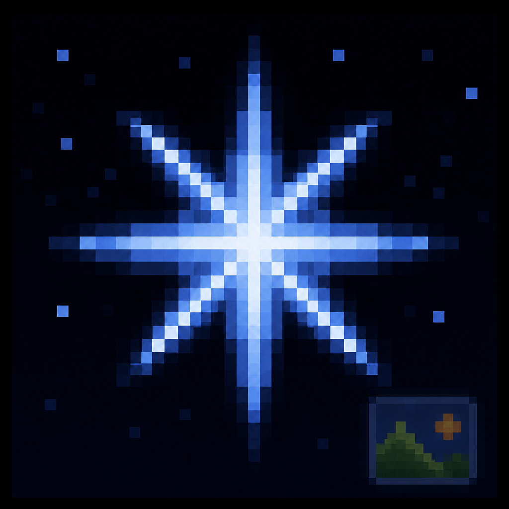
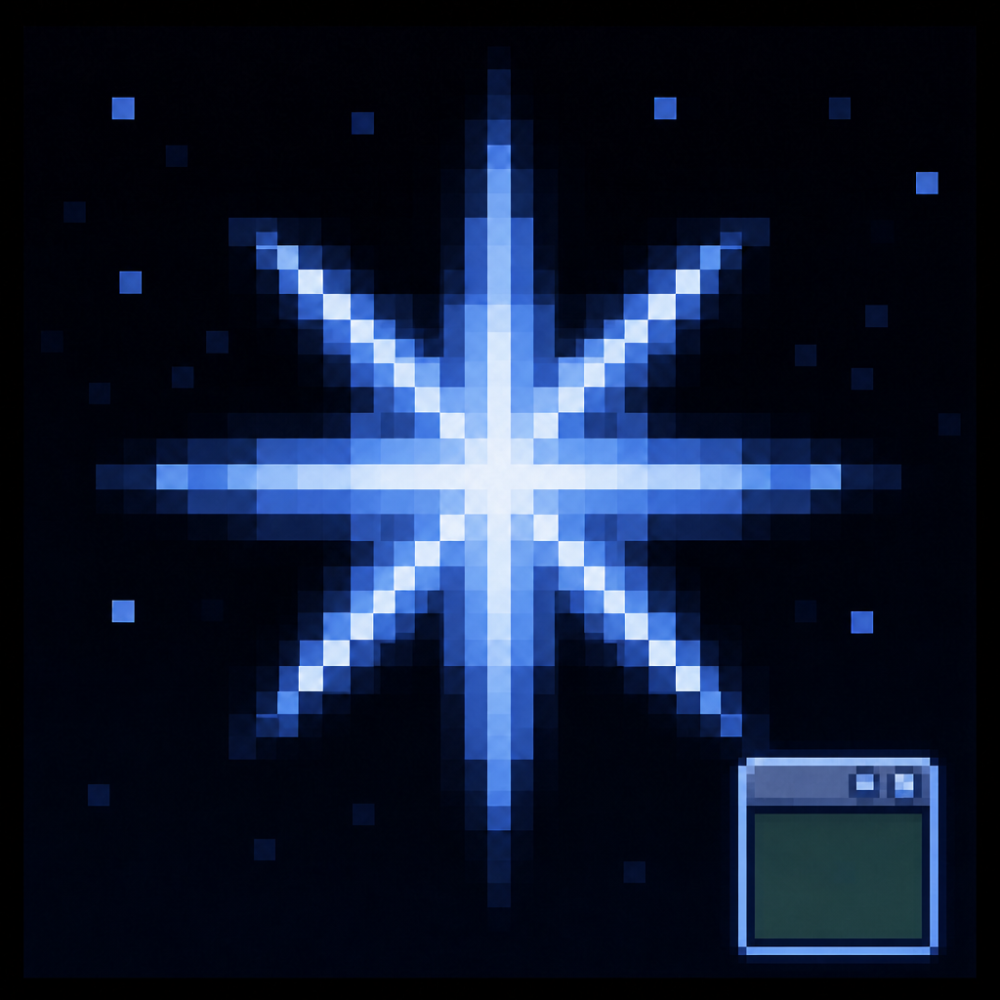

<div align="center">


# Polaris

**Alice in Cradle 模组框架 / Mod framework for Alice in Cradle**

[](LICENSE.txt)
[](https://docs.bepinex.dev/)
[]()


[English](#english) · [中文](#中文)

</div>

---

## 中文

### 简介

Polaris 是 Alice in Cradle 的模组框架，一个 BepInEx 插件（`Polaris.dll`）。
它把模组作者反复要做的四件事一次做好：**接进游戏原生界面**、**加载素材**、**做界面**、**多语言**。

> 项目仍在早期开发阶段，文档与特性列表将持续补充。

四块功能各在自己的命名空间下，但同属一个插件、一个 dll —— 装一个就全都有，
不存在"缺了哪个模块所以某个功能用不了"。

| 命名空间 | 入口 API | 负责 |
| --- | --- | --- |
| `Polaris` | `PolarisAPI` | 菜单接入、设置项、错误分析与崩溃检测等基础设施 |
| `Polaris.Res` | `PolarisResAPI` | 原始格式素材加载（免打 AssetBundle） |
| `Polaris.PUI` | `PolarisUIAPI` | 标准 UI 模板（PUI）与状态机 |
| `Polaris.Lang` | `PolarisAPI.Localization` | `.plang` 多语言 |

 **基础设施**

- **主菜单 / ESC 菜单扩展** —— `PolarisAPI.MainMenu` 加标题画面按钮，`PolarisAPI.GameMenu` 加游戏内菜单分类
- **设置项** —— 给静态字段标 `[PolarisSetting]` 即可渲染进原版设置界面并自动持久化到 `BepInEx/config/Polaris/`；标签、说明与选项文案支持 `&键` 本地化写法（文案来自 `.plang` 或 `PolarisAPI.Localization.Register`）
- **模组管理界面** —— 标题画面的 Polaris 入口，可查看/启停已安装模组
- **错误分析** —— 全局兜底捕获异常，自动判断责任方是某个模组 / Polaris 自身 / 原版游戏，写出报告文件并在标题画面告知上一局的问题；`PolarisAPI.Errors` 供下游模组主动上报
- **致命错误** —— 可以判定"这一局不能继续"（如两个模组撞了同一个本地化 key）：`PolarisAPI.Errors.Fatal` 立刻写出报告，随后在标题画面拦住菜单、把原因摆给玩家看，且只留"退出游戏"一个出口
- **崩溃与卡死检测** —— 会话哨兵记录上一局是否正常退出，后台看门狗盯着主线程还在不在推进帧；上一局崩溃或卡死时，下一局启动会在标题画面告知并写出报告。`PolarisAPI.Health` 供下游模组声明"预期卡顿"（`ExpectStall`）或留一条"正在执行什么"的面包屑（`Activity`）

 **游戏 API v2**

`PolarisAPI.Game` 是接触游戏本体的唯一入口，分工只有一条：**静态 API 只回答全局状态、提供入口和获取实例，其余一律由实例自己完成。**

```csharp
// 静态入口拿实例，实例上做事
GamePlayer player = PolarisAPI.Game.World.CurrentPlayer;
if (player is { IsValid: true } && player.CanAct())
{
    player.HealHp(50);
    player.SetFacing(GameFacing.Right);
}

GameItem potion = PolarisAPI.Game.Items.Resolve("cure_s");
PolarisAPI.Game.Inventory.Main?.Add(potion, count: 3);

// 全局静态回调
PolarisAPI.Game.Callbacks.Register<MapOpenedCallbackData>(
    GameStaticCallbackKind.MapOpened, e => Log($"进入 {e.Map.Key}"));

// 实例回调：只收发生在这一个实例身上的事件
player.Register<PlayerDiedCallbackData>(
    GameInstanceCallbackKind.PlayerDied, _ => Log("玩家倒下了"));
```

- **静态分组** —— `Loop` / `Input` / `Assets` / `Localization` / `World` / `Items` / `Inventory` / `Menu` / `Events` / `Quests` / `Economy` / `Audio`（含 `Audio.Bgm`）
- **实例类型** —— `GameMap`、`GameCharacter`、`GamePlayer`、`GameEnemy`、`GameItem`、`GameStorage`、`GameAudioPlayback`、`GameMenu`、`GameEvent`、`GameQuest`
- **身份稳定** —— 同一个游戏对象在存活期内永远给出同一个包装器实例，可以直接当字典键
- **失效即拒绝** —— 切图、关闭、销毁之后旧实例失效：只读成员返回零值/空值，写操作抛 `InvalidGameInstanceException`，绝不会安静地作用到"下一任住客"身上
- **回调分两种** —— 28 个全局静态回调走 `PolarisAPI.Game.Callbacks.Register`，26 个实例回调注册在对应实例上；注册时 `TData` 与回调种类不匹配会立刻抛异常，而不是留一个永远收不到事件的注册
- **公开签名不出现游戏类型** —— 收发的全是 Polaris 自己的类型，换游戏版本时要改的假设集中在 `Polaris.API` 内部

 **资源加载**

- **原始格式直接用** —— `.png`/`.jpg`、PixelLiner 的 `.pxls`、`.wav`/`.ogg`/`.mp3`、`.mp4`，无需打包成 AssetBundle
- **零代码自动绑定** —— 给静态字段标 `[PolarisResource]`、类上标 `[PolarisResourceFolder]`，启动时自动挂载并回填
- **旁路导入设置** —— `_import.json` / `<file>.import.json` 控制 filter/wrap/mipmap/压缩等，无需改代码

 **UI（PUI）**

- **PUI 模板** —— 用 PolarisTools 可视化编辑 `.pui`，编译期生成强类型 C# 代码
- **状态机（.puisln）** —— 把多个 PUI 连成图，可视化编辑跳转关系，运行时按图驱动
- **热重载** —— 程序集标 `[PUIHotFixEnabled]` 后，编辑器里改动即时反映到运行中的游戏
- **菜单集成** —— `PolarisUIAPI.MainMenu` / `.GameMenu` 一行把 PUI 接到主菜单按钮或 ESC 菜单分类
- **图片控件** —— 直接引用资源加载给出的模组素材

 **多语言（.plang）**

- **`.plang` 文件** —— 一个 key 一行的文案表，支持多语言列（每种语言可单独启用/禁用），用 PolarisTools 表格式编辑
- **强类型 Key** —— 保存 `.plang` 时自动生成 C# 属性，`Lang.SomeKey` 直接就是这个 key 在当前游戏语言下的文案，拼错 key 编译期就报错
- **编译期注册，不依赖运行时数据文件** —— 生成的代码在程序集加载时自动把 key/多语言文案注册进 `PlangRuntime`，不需要在发布包里带 `.plang` 文件
- **按当前语言取词** —— 按 `PolarisAPI.Game.Localization.CurrentLocale`（玩家当前选的游戏语言）匹配对应语言列，匹配不到就用中性值兜底
- **接入原生查表** —— 同时注册进 `PolarisAPI.Localization`，游戏自己的 `TX.Get`（含 PUI 的 `&键` 语法）也能查到同一份文案
- **key 冲突当场拦停** —— 同一个 key 被两个模组注册就是致命错误：哪份文案生效取决于模组加载顺序，玩家只会看到"某个模组的界面上显示着另一个模组的文字"，几乎不可能追回到 key 撞车。所以只要撞上一个就写出报告（列出 key 与涉及的模组），并在标题画面拦住菜单请玩家退出游戏

### 安装

- [暂无]

### 构建

```powershell
.\deploy-polaris.ps1            # 编译并部署进本机装了 BepInEx 的游戏（开发内循环）
.\deploy-polaris.ps1 -Package   # 打一份可以直接发给玩家的 dist\Polaris-v<版本>.zip
```

编译期引用的游戏程序集位置见 `Directory.Build.props`（环境变量 `AIC_GAME_DIR` 或
`Directory.Build.props.user` 可覆盖）；部署目标见脚本的 `-DeployDir` / `AIC_DEPLOY_DIR`。

### 相关项目

| 项目 | 说明 |
| --- | --- |
| [PolarisTools](https://github.com/AAAA9731/PolarisSourceCodeGenerator) | `.pui`/`.puisln`/`.plang` 的可视化编辑与代码生成，配套 VS 扩展（开发工具，非运行时依赖） |

### 许可证

本项目基于 [LGPL-2.1](LICENSE.txt) 许可证开源。

---

## English

### Overview

Polaris is a mod framework for Alice in Cradle, shipped as a single BepInEx plugin
(`Polaris.dll`). It does the four things every mod author ends up doing anyway, once and properly:
**hooking into the game's native UI**, **loading assets**, **building interfaces**, and
**localization**.

> Early development stage — docs and feature list will grow over time.

The four areas live in their own namespaces but belong to one plugin, one dll — install it and you
have all of it; there is no "feature X is unavailable because module Y is missing".

| Namespace | Entry API | Responsibility |
| --- | --- | --- |
| `Polaris` | `PolarisAPI` | Menu integration, settings, error diagnostics, crash detection |
| `Polaris.Res` | `PolarisResAPI` | Raw-format asset loading (no AssetBundle step) |
| `Polaris.PUI` | `PolarisUIAPI` | Standard UI templates (PUI) and state graphs |
| `Polaris.Lang` | `PolarisAPI.Localization` | `.plang` localization |

 **Infrastructure**

- **Main / in-game menu extension** — add title-screen buttons and ESC-menu categories
- **Settings** — tag a static field with `[PolarisSetting]`; it renders into the vanilla settings screen and persists automatically. Labels, descriptions and choice captions accept the `&key` localization form
- **Mod manager UI** — browse and toggle installed mods from the title screen
- **Error diagnostics** — catches unhandled exceptions globally, attributes them to a mod / Polaris itself / the base game, writes a report file, and notifies the player of the previous run's issues on the title screen; `PolarisAPI.Errors` lets downstream mods report proactively
- **Fatal errors** — a run can be declared unsalvageable (e.g. two mods claiming the same localization key): `PolarisAPI.Errors.Fatal` writes the report at once, then a full-screen title page explains why and offers quitting the game as its only exit
- **Crash & hang detection** — a session sentinel records whether the previous run exited cleanly, and a background watchdog watches whether the main thread is still advancing frames; if the previous run crashed or hung, the next launch reports it on the title screen and writes a report. `PolarisAPI.Health` lets downstream mods declare an expected stall (`ExpectStall`) or leave a breadcrumb of what they're currently doing (`Activity`)

 **Asset loading**

- **Raw assets, no bundling** — `.png`/`.jpg`, PixelLiner `.pxls`, `.wav`/`.ogg`/`.mp3`, `.mp4`
- **Zero-code auto binding** — tag static fields with `[PolarisResource]` and the class with `[PolarisResourceFolder]`
- **Sidecar import settings** — `_import.json` / `<file>.import.json` control filter/wrap/mipmap/compression

 **UI (PUI)**

- **PUI templates** — author `.pui` visually in PolarisTools, get strongly-typed C# at compile time
- **State graphs (.puisln)** — wire several PUIs into a graph and drive it at runtime
- **Hot reload** — tag the assembly with `[PUIHotFixEnabled]` and edits land in the running game
- **Menu integration** — one call to attach a PUI to a main-menu button or ESC-menu category
- **Image controls** — reference mod assets straight from the asset loader

 **Game API v2**

`PolarisAPI.Game` is the only entry point that touches the game itself. One rule governs the split: **static API answers global state, provides entry points, and hands out instances — everything else happens on the instance.**

```csharp
GamePlayer player = PolarisAPI.Game.World.CurrentPlayer;
if (player is { IsValid: true } && player.CanAct())
{
    player.HealHp(50);
}

PolarisAPI.Game.Callbacks.Register<MapOpenedCallbackData>(
    GameStaticCallbackKind.MapOpened, e => Log($"entered {e.Map.Key}"));

player.Register<PlayerDiedCallbackData>(
    GameInstanceCallbackKind.PlayerDied, _ => Log("player went down"));
```

- **Static groups** — `Loop` / `Input` / `Assets` / `Localization` / `World` / `Items` / `Inventory` / `Menu` / `Events` / `Quests` / `Economy` / `Audio` (with `Audio.Bgm`)
- **Instance types** — `GameMap`, `GameCharacter`, `GamePlayer`, `GameEnemy`, `GameItem`, `GameStorage`, `GameAudioPlayback`, `GameMenu`, `GameEvent`, `GameQuest`
- **Stable identity** — the same game object always yields the same wrapper instance while it lives, so it is safe as a dictionary key
- **Invalid means refused** — after a map change, a close, or a destroy, reads return zero/null and writes throw `InvalidGameInstanceException`; a stale wrapper never silently acts on the object that replaced it
- **Two kinds of callbacks** — 28 global static kinds via `PolarisAPI.Game.Callbacks.Register`, 26 instance kinds registered on the instance itself; a `TData` that does not match the kind throws at registration time rather than leaving a callback that never fires
- **No game types in public signatures** — everything crossing the boundary is a Polaris type, so version-specific assumptions stay inside `Polaris.API`

 **Localization (.plang)**

- **`.plang` files** — one key per row, with multi-language columns (each language can be enabled/disabled independently), edited as a grid in PolarisTools
- **Strongly-typed keys** — saving a `.plang` regenerates C# properties, so a typo is a compile error; the property resolves to the text for the player's current game language
- **Compile-time registration, no runtime data file** — the generated code registers its keys/multi-language text into `PlangRuntime` when the assembly loads, so `.plang` files don't need to ship in the release package
- **Current-language lookup** — matches `PolarisAPI.Game.Localization.CurrentLocale` against the per-language columns, falling back to the neutral value when there's no match
- **Native lookup integration** — also registered with `PolarisAPI.Localization`, so the game's own `TX.Get` (including PUI's `&key` syntax) finds the same text too
- **Key collisions halt the run** — one key registered by two mods is a fatal error: which text wins depends on mod load order, so the player would just see one mod's strings inside another mod's UI and could never trace it back to a key collision. A single collision is enough: a report is written (listing the key and the mods involved) and the title screen blocks the menu, asking the player to quit

### Installation

- [Nope]

### Building

```powershell
.\deploy-polaris.ps1            # build and deploy into a local BepInEx-enabled game (dev loop)
.\deploy-polaris.ps1 -Package   # produce a player-installable dist\Polaris-v<version>.zip
```

Where the game assemblies are referenced from is configured in `Directory.Build.props` (override
with the `AIC_GAME_DIR` env var or a `Directory.Build.props.user`); the deploy target comes from
the script's `-DeployDir` / `AIC_DEPLOY_DIR`.

### Related Projects

| Project | Description |
| --- | --- |
| [PolarisTools](https://github.com/AAAA9731/PolarisSourceCodeGenerator) | Visual editing and codegen for `.pui`/`.puisln`/`.plang` — a companion VS extension, not a runtime dependency |

### License

Released under the [LGPL-2.1](LICENSE.txt) license.
