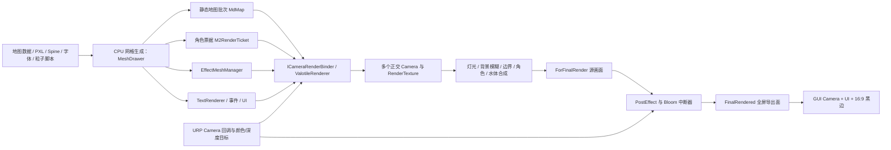

# 《Alice in Cradle》Windows ver029 渲染系统逆向分析报告

> 分析对象：`D:\AliceInCradle Win ver029\AliceInCradle_ver029`  
> 产品版本：`0.29j`  
> Unity 版本：`2022.3.62f2 (7670c08855a9)`  
> 分析日期：2026-08-16  
> 报告性质：针对发行版的静态逆向、Unity 资源解包与交叉验证；不是原始 Unity 工程审计。

## 1. 结论摘要

这个游戏并不是一个“主要依赖 URP 2D Renderer、SpriteRenderer 和 Unity ParticleSystem”的常规 Unity 2D 项目。它的真实结构是：

1. **URP 负责平台级相机生命周期和最终颜色/深度目标的接入**；
2. **游戏自研的 `MeshDrawer + ICameraRenderBinder + ValotileRenderer` 体系负责绝大多数实际绘制、排序和合成**；
3. 地图、角色、灯光、水体、粒子、事件立绘、文字和 UI 大量使用 CPU 生成网格，再通过 `Material.SetPass`、`GL` 即时绘制或少量 `Graphics.DrawMesh` 输出；
4. 世界画面先在约 `1296×736` 的内部 16:9 画布上完成多相机、多 RenderTexture 合成，然后通过 `ForFinalRender → FinalRendered → GUI` 链路导出；
5. 像素稳定性靠固定 64 PPU、整数像素缩放、投影矩阵吸附、Point 过滤和量化缩放共同保证；
6. “灯光”主要是低分辨率彩色光照纹理与场景颜色合成，并不是 Unity 实时灯/阴影系统；
7. 水体不是单纯透明贴图，而是会采样背景、主场景、边界、角色、光照和噪声纹理的屏幕空间合成；
8. 后处理是独立于 URP Volume 的自研系统，包含 32 个逻辑通道，能够同时影响画面、相机、时间缩放、雨量和音频；
9. 性能策略明显针对“大量 2D 内容 + 低分辨率像素画”：静态地图网格合批/烘焙、脏标记重建、相机裁剪、RenderTexture 池、材质缓存、低分辨率光照和 Bloom 金字塔。

一句话概括：**这是一个把 Unity/URP 当作宿主与跨平台后端、把真正 2D 渲染器写在游戏代码里的混合式引擎。**

## 2. 分析范围、方法与可信度

### 2.1 已执行的工作

- 对发行目录、引擎版本、Managed 程序集、启动配置和 StreamingAssets 做完整清点；
- 对 `Assembly-CSharp.dll` 和 `unsafeAssem.dll` 做当前版本的全量反编译；
- 解析主资源文件和全部 `.dat` UnityFS AssetBundle；
- 导出 Shader 名称、属性、SubShader/Pass 状态及可恢复的编译后文本；
- 导出 Material、MonoBehaviour、ProjectSettings、Tag/Layer、BuildSettings 和对象索引；
- 从相机创建、相机回调、地图绘制、角色票据、灯光、水体、特效、UI 和最终合成两端交叉追踪调用关系；
- 对类引用覆盖率、资源清单和 Shader 清单做自动统计。

### 2.2 证据等级

本文使用以下标记：

- **[代码事实]**：反编译代码中存在直接控制流或常量证据；
- **[资源事实]**：Unity 序列化对象、AssetBundle、Manifest 或 Shader 记录直接给出；
- **[综合判断]**：由多个代码/资源事实共同推出；
- **[待运行验证]**：静态发行版无法证明每帧实际启用状态。

核心相机图、内部尺寸、图层、Stencil、材质/Shader 名、地图与角色绘制路径均为高可信度。不同地图实际选用哪一个 Dungeon 派生类、同一帧启用哪些后处理以及具体显存峰值，属于运行时状态，本文不会伪装成确定值。

### 2.3 解包完整性

共扫描：

| 项目 | 数量 |
|---|---:|
| Unity 资源文件/Bundle | 387 |
| 序列化对象 | 5,868 |
| `.dat` UnityFS Bundle | 378（约 251.6 MiB） |
| Bundle Manifest | 370 |
| 地图 `.tmap` | 476 |
| 命令脚本 `.cmd` | 968 |
| Texture2D | 267；成功导出 253 张 PNG |
| 恢复的 Shader 记录 | 222 |
| 成功解析的 Material | 23 |
| MonoBehaviour | 496 |
| 反编译 C# 文件 | 1,651，约 601,893 行 |

存在 10 个 UnityPy 类型树兼容错误：6 个 Shader（编译数据尾部长度差异）和 4 个韩文字体 Material（类型树缺失）。它们已逐项记录在 `errors.json`。Shader Manifest、代码中的 Shader 名和其余 222 个 Shader 足以覆盖主渲染架构；但不能据此宣称字节级 100% 无损恢复。

## 3. 发行版与图形后端

### 3.1 基础配置

| 项目 | 结果 | 证据 |
|---|---|---|
| 引擎 | Unity 2022.3.62f2 | Player/Bundle 版本串 |
| 脚本后端 | Mono | `MonoBleedingEdge`、Managed DLL | 
| 渲染管线 | Universal Render Pipeline | `UniversalRenderPipelineAsset`、RendererData |
| 颜色空间 | Gamma | `m_ActiveColorSpace = 0` |
| HDR | 关闭 | Player/Graphics Settings |
| 多线程渲染 | 开启 | `m_MTRendering = true` |
| 目标帧率 | 60 | `IN.targetFrameRate` 运行时代码 |
| VSync | 关闭 | 唯一 Quality 档 `vSyncCount = 0` |
| MSAA | 关闭 | `antiAliasing = 0` |
| Unity 实时阴影 | 关闭 | `shadows = 0` |
| Pixel Light | 0 | `pixelLightCount = 0` |
| 动态批处理 | 构建标记开启 | BuildSettings |

PlayerSettings 中的默认窗口为 `1024×768`，但这不是游戏渲染内容的逻辑分辨率。游戏代码固定使用 `IN.w = 1280`、`IN.h = 720`、`ppu = 64`，并在外部窗口中计算 16:9 有效区域与黑边。

### 3.2 URP 资产

发行版包含三套 RendererData：

- `URP_Renderer_Game`：2D RendererData；
- `URP_Renderer_TTR_Forward`：Universal Forward RendererData；
- `URP_Renderer_UI`：2D RendererData。

同时注册了两个名为 `OnRenderImageLikeFeature` / `CustomRenderPassFeature` 的自定义 Renderer Feature。其自定义 Pass 插入点是 `AfterRenderingPostProcessing`。

这里容易产生误解：**URP 2D Renderer 存在，并不等于游戏主光照由 URP 2D Light 完成。**代码证据显示，游戏灯光主体是自己的低分辨率 RT 与合成 Shader；Unity Quality 也关闭了实时光和阴影。

## 4. 总体架构

### 4.1 URP 与自研渲染器的边界

`CustomRenderPassFeature` 在 URP 后处理结束后取得 `cameraColorTargetHandle.rt` 与深度 RT，并交给 `CameraBindingsBehaviour`。后者订阅 `RenderPipelineManager.beginCameraRendering/endCameraRendering`，分别执行前置和后置 Binder。

Binder 按 `getFarLength()` 降序排列。需要读写屏幕的 Binder 使用两张互换 RenderTexture 做 ping-pong，避免源和目标相同。主相机可直接接入 URP 颜色/深度目标；子相机则使用自己的 `targetTexture`。

因此 URP 在这里更像：

- 相机调度与平台后端；
- 颜色/深度目标提供者；
- 自定义 Pass 插入宿主；
- 少量标准资源和兼容 Shader 提供者。

而实际内容绘制、Z 顺序、屏幕采样与最终组合主要由游戏代码决定。

## 5. 坐标、像素与最终显示

### 5.1 固定逻辑画布

`IN` 定义：

- 逻辑宽高：`1280×720`；
- `PPU = 64`；
- 世界单位换算：`1/64`；
- 相机安全边：主 RT 使用 `(1280+16) × (720+16)`，即基础 `1296×736`；
- `pixel_scale` 最低可到 `0.25`。

额外 16 像素给震屏、缩放、混乱旋转和边缘采样留出余量，减少最终画面边缘露底。

### 5.2 PerfectPixelCamera

`PerfectPixelCamera` 的机制不是简单设置 `PixelPerfectCamera` 组件：

1. 强制正交相机；
2. 以 64 PPU 计算屏幕比例；
3. 对 RenderTexture 场景取整数 `pixel_scale`；
4. 将相机位置按 `1 / (pixel_scale × 64)` 网格吸附；
5. 用偏移过的正交投影矩阵消除亚像素抖动；
6. 使用正交透明排序。

`M2Camera.fixScaleFloat` 还会把缩放量化到与内部高度相容的离散值。最终导出纹理在整数像素缩放且相机比例不小于 1 时用 Point，否则切到 Bilinear，避免非整数缩放产生严重锯齿/跳动。

### 5.3 窗口与黑边

`getCameraRectForApp` 始终计算 16:9 有效矩形。超出逻辑画布的区域以黑色 doughnut 网格覆盖。因此 4:3 默认窗口并不拉伸游戏内容，而是 letterbox/pillarbox。

## 6. 主相机图与逐帧流水线

### 6.1 通用主链

`M2Camera.initBufferScreen/initCameraFinalize/RenderWholeCamera` 构成主干：

1. 创建内部颜色 RT，通常为 `(IN.w+16)×(IN.h+16)×pixel_scale`，Point、Mirror；
2. 构建地图所需的若干正交子相机；
3. 将普通相机输出合并到源相机 Binder，或渲染到各自 RT；
4. 源相机输出到 `ForFinalRender` 图层；
5. `FinalRendered` 相机通过全屏网格采样源 RT；
6. 后处理可在源画面或最终画面阶段插入；
7. 最终网格交给 GUI 层，相机位移、震屏、缩放、旋转和透明度在这里统一应用。

`RenderWholeCamera` 会显式触发相机与 Binder，并在关键位置刷新 GL，而不是完全依赖 Unity 自动相机顺序。

### 6.2 DungeonBright 典型多通道图

不同 Dungeon 派生类可改写材质和颜色，但 `DungeonBright` 给出了最完整、最具代表性的图：

| 通道 | 内容 | 分辨率/格式 | 用途 |
|---|---|---|---|
| `LightCamX` | 自研圆形/图标灯光 | 1/8 宽高、ARGB32 | 场景光照纹理 |
| `DCBack` | `ChipsSubBottom` | 全/配置比例 | 水下/后景采样 |
| Base 缓存 | 主背景 | 1/4、ARGB4444 | 低成本背景输入 |
| `MainBlured` | BrightCacheRenderer 输出 | RG16 | 明度/模糊背景 |
| `DCMain` | 地图主层 | 全分辨率 | 地图主体 |
| `DCMover` | `MoverRender` | 全分辨率 | 角色/动态物体独立输入 |
| `DCBorder` | `ChipsForBorder` | 1/2 | 水边/轮廓/边界输入 |
| `DCMainRendered` | 主图 + 灯光 + 动态层 | 内部主 RT | 进入最终链的场景 |
| Final source | `ForFinalRender` | 内部主 RT | 后处理输入 |
| Final export | `FinalRendered` | 屏幕导出 | 相机效果和 UI 下层 |

主要依赖关系：

- `M2d/ImageWithLight`：`MainTex + LightTex + MoverTex`；
- `M2d/ImageWithLightAndBright`：再加入 `BlurTex`、雨量、夜色和效果变量；
- `M2d/WaterInBright`：同时接收 `DCBack`、`DCMain`、`DCBorder`、`DCMover`、`LightTex` 和 `NoiseTex`；
- `M2d/BorderLight`：边界 RT + 光照 RT；
- chip 背景/顶部材质共享低分辨率 `LightTex`。

### 6.3 Dungeon 派生体系

发现的主要环境派生包括 Forest、ForestHiroba、ForestInTree、Grazia、Glacier、House 系列、Mount、Sacred、Sea。它们复用相机图，但可覆盖：

- 水和背景 Shader；
- 环境主色、底色、夜色；
- 雨量与特效变量；
- 需要进入哪些相机层；
- 水面反射与特殊景观合成。

这说明“关卡美术风格”主要通过数据化颜色容器和材质变体实现，而不是为每张地图重新搭一套 Unity Scene 相机。

## 7. 绘制核心：MeshDrawer、Binder 与 Valotile

### 7.1 MeshDrawer

`MeshDrawer` 是整个系统的中心抽象，单文件约 6,200 行。它维护 CPU 侧的：

- 顶点、颜色、UV/UV2/UV3；
- 三角形索引与多 SubMesh；
- Material 列表和渲染队列；
- 矩形、圆、多边形、线、渐变、圆角框等程序化图元；
- PXL 帧/图层转网格；
- Mesh 上传或 GL 即时绘制路径。

584 个反编译文件引用 `MeshDrawer`，说明它不是局部工具，而是游戏渲染 API 本身。

### 7.2 ICameraRenderBinder

Binder 是“把某段自定义绘制挂到某台相机”的接口：

- 以 `getFarLength()` 表示全局顺序；
- 接收相机投影容器；
- 可在镜头缩放变化时重建网格；
- 可选择普通绘制、RenderTexture 输入或屏幕 ping-pong；
- 灯光、水、暗幕、角色、地图效果、后处理都以 Binder 进入相机。

这套顺序绕开了 Unity 单一 SortingLayer。发行版的 SortingLayer 事实上只有 `Default`，真正的层级来自 Unity Layer、相机 culling mask、Mesh Z、Binder far length 和 Blend/Stencil 的组合。

### 7.3 ValotileRenderer

`ValotileRenderer` 启用时会关闭原始 `MeshRenderer`，直接对 `MeshDrawer` 的各 SubMesh 调用材质 Pass，再通过 `BLIT.RenderToGLImmediate...` 输出。它支持：

- 自定义相机或 GUI 相机绑定；
- SubMesh 与 MaterialPropertyBlock；
- NDC bounds 裁剪；
- Z/far 排序；
- alias/代理；
- 禁用时回退普通 MeshRenderer。

它解决的是像素游戏里普通 Unity Renderer 不容易同时满足的三个要求：严格顺序、低层 GL 控制、可切换到常规 Renderer 的兼容性。

## 8. 地图渲染

### 8.1 静态层结构

`Map2d.prepareMeshDrawer` 建立的主要地图批次包括：

- Chip：`B / G / T / L / TT / LT`；
- Gradation：`U / B / G / T`；
- `UCol`；
- `Water`。

各批次的 Unity Layer、Z 和 Material 由当前 Dungeon 决定。`M2MeshContainer` 管理这些 `MdMap`，能够在普通 MeshRenderer 和 Valotile 路径间切换。

### 8.2 增量重建

地图更新使用 bitmask 脏标记：只有受影响的 MeshDrawer 才重新上传。带动画/可重绘的 Chip 也会先做相机可见性检查，避免离屏更新。

### 8.3 静态地图简化/烘焙

`MdMap` 可将不可交互、不可重新排列的静态 chunk 合并到池化 MeshDrawer，进一步烘焙到边界精确、Point 过滤的 ARGB32 RenderTexture，然后以一个四边形显示；可变部分保留独立 SubMesh。

这相当于运行时 2D chunk cache：

- 减少重复顶点和 draw call；
- 保持像素边缘；
- 地图/层级独立失效；
- 允许局部清除、阴影和动态覆盖。

代价是地图切换或大范围修改时会产生 RT 分配和重新烘焙尖峰。

## 9. 角色、敌人与动态物体

### 9.1 Mover 独立通道

`M2MovRenderContainer` 将动态物体分为四组，并用 `M2RenderTicket` 管理：

- mask/back；
- buffer/main：`BUF_0/1/2`、`PR0/1/2`，进入专用 `MoverRender` RT；
- top；
- CM。

完整顺序枚举还包括 `MASK_B/G/T`、`N_BACK0/1`、前后效果层、`N_TOP0/1/2`、`CM0/1/2`。角色因此可被水体、光照、遮罩和前景分别采样，而不是只能作为最终画面上的一张 Sprite。

### 9.2 M2RenderTicket

每张票据包含绘制回调、顺序、材质/网格、可见范围和脏状态。执行时：

- 先验证相机覆盖；
- 同帧只在必要时重建网格；
- 遍历 SubMesh 与材质 Pass；
- 通过 GL 投影绘制；
- 普通 GameObject/MeshRenderer 可保持关闭。

动画主体多数来自 PixelLiner/PXL 帧。`M2PxlAnimator` 按 64 PPU 将 PXL 图层、锚点和翻转转换到世界坐标；敌人或 UI 立绘的复杂骨骼动画则可使用 Spine。

## 10. 灯光、暗部与 Bloom

### 10.1 低分辨率光照

`M2Light` 默认半径为 60，使用 `EffBlurCircle245` 生成带羽化的矩形光斑。光源可跟随 Mover，带位置平滑、出现/隐藏延迟、颜色和 RGB alpha，并先做相机覆盖裁剪。

`CameraRenderBinderLight` 将所有地图光源绘制到 `LightCamX`。典型 Bright Dungeon 的光照 RT 宽高各为主画面的 1/8，也就是像素数约为主画面的 1/64；随后由双线性采样平滑放大。这是非常便宜、且适合像素画柔光的做法。

### 10.2 全局暗幕

`M2DarkRenderer` 使用 `M2d/WholeDarkArea` 采样光照纹理，在整个 `1296×736` 区域绘制暗层；地图进入/退出有 20/70 帧淡入淡出。镜头缩小时还补一个黑色 doughnut，避免安全边以外露出。

### 10.3 环境调色

`DungeonBright.fineMaterialColor` 根据 `DgnColorContainer`、`night_level`、`rain_level` 和 `effect_variable0` 更新地图、背景、边界、水体和角色合成材质。光照并不是单一乘法，而是和白色/暗色映射、背景亮度缓存、雨天参数一起参与颜色重构。

### 10.4 自研 Bloom

`Kayac.LightPostProcessor` 的流程：

1. 从源画面提取阈值以上亮度；
2. 从 `bloomStartLevel`（默认 2，即 1/4）开始建立最多 7 层的降采样矩形；
3. 水平高斯模糊；
4. 垂直高斯模糊；
5. 按 `bloomStrengthMultiplier` 组合层级；
6. 与原图合成，同时可做 color offset、scale、saturation。

多个层级被打包进三张 atlas RT（`bloomX/bloomXY/bloomCombined`），避免为每一层创建独立 RT。默认 ARGB32，可选硬件支持时 ARGB2101010。原场景采样保持 Point，Bloom 纹理使用 Bilinear。

## 11. 水体、瀑布与反射

水体至少存在三条相关路径：

1. `CameraRenderBinderWater` 绘制地图水网格；主地图使用 GL，SubMap 可用 `Graphics.DrawMesh`；
2. `M2CImgDrawerWater/WaterFall` 生成水面上沿、加法高光和瀑布网格，瀑布材质接收相机位置；
3. `CameraRenderBinderWaterSurface` 从 `getFinalizedTexture()` 采样已完成场景，绘制水面反射带，并按水面高度动态重建。

Bright 路径中的 `M2d/WaterInBright` 同时拥有：

- 后景 `MainTex/ChipTex`；
- 主场景；
- 水边/边界；
- Mover mask；
- LightTex；
- NoiseTex；
- Stencil 30；
- 8 像素屏幕边距。

因此可实现角色入水遮挡、背景折射/扰动、受光变化、水边轮廓与前后层次。LAVA/SEA 还通过 Shader keyword 和 `_LavaCol` 切换外观，并叠加一次性粒子。

## 12. Shader 与材质体系

### 12.1 资源统计

成功恢复的 222 个 Shader 按命名空间分组：

| 分组 | 数量 | 主要用途 |
|---|---:|---|
| `Hachan/*` | 85 | 通用 GDT、Mesh、字体、Stencil、Blend 变体 |
| `Hidden/*` | 49 | URP 内部 Shader、自研 Bloom 四件套 |
| `M2d/*` | 28 | 地图、光照、背景、水、边界、渐变 |
| `nel/*` | 16 | 游戏特定视觉效果 |
| `poste/*` | 15 | 状态/战斗后处理 |
| `GuineaLion/*` | 8 | 书本/3D 小游戏资源 |
| `Buffer/*` | 7 | 拷贝、深度、旋转、清除 |
| 其他 | 14 | PixelLiner、Sprites、Spine、URP 等 |

核心地图 Shader 包含 `BasicMapWithLight`、`ImageWithLight`、`ImageWithLightAndBright`、`WaterInBright`、`WaterReflectionSurface`、`BorderLight`、`WholeDarkArea`、`SubMapBlending`、`DissolveFade` 等。

游戏专用效果包括 Frozen、Stone、ConfuseCurtain、RakuraiGlitch、BlackHole、ShieldBlurBehind、LiquidDigit、firewall、noise dissolve，以及 HP/MP、burst、flash、sepia、gas、worm、shotgun 等 `poste/*` Shader。

### 12.2 材质工厂与 Blend 变体

`MTRX` 从 `mti_shader.dat` 加载并缓存 Shader/Material。缓存键包含 `stencil_ref` 与 Shader。`BLEND` 并非只改一组 `_SrcBlend/_DstBlend`，很多模式会直接选择不同 Shader 变体：Normal、Add、Sub、Mul、Mask、Stencil 等。

部分 Blend 类型还通过微小 Z 偏移稳定排序，例如 mask、sub、mul、add 使用不同偏移方向。由于大量绘制是 `SetPass + GL`，这些材质状态就是实际管线状态，不能只看 GameObject 上挂了什么 Renderer。

### 12.3 编译后 Shader 的限制

发行包保存的是 Unity 编译后的 Shader 序列化数据。可恢复属性、SubShader/Pass、关键字、Blend/Stencil/Z 状态和平台程序，但通常不能恢复原作者的 HLSL 文件结构、注释、ShaderGraph 节点名称或宏展开前源码。本报告对其称“恢复的 Shader 描述”，而不是“原始 Shader 源码”。

## 13. 粒子与一般特效

游戏主体没有依赖 Unity ParticleSystem 构建战斗特效，而是自研：

- `Effect` 管理池，常见容量上限约 240；
- `EffectItem` 以标题解析/缓存 `fnRunDraw_<title>`，或调用粒子定义；
- `EffectMeshManager` 按材质、标题和 top/bottom 分组并复用 MeshDrawer；
- `EfParticle` 数据化描述数量、寿命、位置、速度、旋转、颜色、渐变、Blend、层级和 PXL 帧；
- 支持相机裁剪、质量等级、UI 时间缩放与世界时间缩放。

优点是粒子能和地图 Z、Stencil、水体、Mover RT 及游戏时间完全一致；代价是 CPU 网格构建和自定义脚本解释的成本会集中在特效爆发帧。

## 14. 后处理系统

`POSTM` 定义 32 个逻辑通道：

| 类别 | 通道 |
|---|---|
| 生命/资源 | `HP_REDUCE`、`MP_REDUCE`、`MP_ABSORBED` |
| 战斗/状态 | `WORM_TRAPPED`、`THUNDER_TRAP`、`BURST`、`SHOTGUN`、`STONEOVER`、`GAS_APPLIED` |
| 场景/事件 | `SUMMONER_ACTIVATE`、`ENEMY_OVERDRIVE_APPEAR`、`MAGIC_DEVICE_ACTIVATE`、`MAGICSELECT` |
| 屏幕效果 | `WHOLERIPPLE`、`FLASH`、`JAMMING`、`POST_BLOOM`、`IRISOUT`、`SEPIA`、`GO_CLOSE_EYE` |
| 相机/时间 | `TS_SLOW`、`ZOOM2`、`ZOOM2_EATEN`、`HEARTBEAT`、`CONFUSED_CAMERA` |
| 环境/全局 | `RAIN`、`M2D_VAR_0`、`FINAL_ALPHA` |
| 音频联动 | `SND_VOLUME_REDUCE`、`BGM_LOWER`、`BGM_WATER` |
| 其他 | `LAYING_EGG` |

系统有三类执行器：

- `PEMaterial`：屏幕网格 + 后处理材质；
- `PEInterrupt`：相机中断器，例如 LightPostProcessor Bloom；
- `PESpecial`：时间、缩放、混乱旋转、雨量、最终 alpha 和音频参数。

同一帧会按 `MINMAX/ADD/SCREEN/MUL` 策略聚合所有 PostEffectItem，再一次性写回地图时间缩放、相机比例、雨量/环境变量、音量和最终透明度。`top_flag >= 2` 的材质效果会要求更换源/目标 RT，形成真正的全屏反馈，而不是简单覆盖一层半透明 Quad。

配置项 `posteffect_weaken` 会限制/弱化同时激活的效果，是面向可读性或性能的降级入口。

## 15. UI、文字、事件立绘与 Spine

### 15.1 UI 相机与层

世界最终画面交给 GUI Camera，主要 UI 在 Unity Layer 25 `GUI`；Layer 5 `UI` 仍用于 Unity UI/场景对象。资源里有大量 RectTransform/CanvasRenderer，但游戏内复杂界面依然广泛使用 `MeshDrawer + ValotileRenderer`。

### 15.2 自研文字

`TextRenderer` 不是 TextMeshPro。它从 Unity Font 动态字形纹理读取 `CharacterInfo`，将每个字构造成 MeshDrawer Quad，并支持：

- 自动换行、对齐、字距、行距、等宽；
- 边框 Shader；
- Ruby 注音；
- HTML 风格标签和内嵌 PXL 图标；
- 渐变/样式 SubMesh；
- Stencil 裁剪和滚动区域；
- 字体纹理重建监听与自动重画。

`FontStorage` 按字体、边框颜色和 StencilRef 缓存材质。发行资源包含 Cabin Condensed、Logo Type Gothic、Utsukushi、Moby，以及中文/韩文附加字体 Bundle。

### 15.3 Stencil 驱动的 UI/事件遮罩

重要 Stencil 常量包括：

| 用途 | 值 |
|---|---:|
| 参数/提示 | 10 |
| KeyConfig | 11 |
| MP Egg | 12/13 |
| HUD | 14 |
| Cut-in | 20 |
| Water | 30 |
| Message | 58 |
| Event | 70 起，随层/编号偏移 |
| Item Move | 170 |
| UI Box | 180/200 |
| Game UI | 225/230/239 |
| M2D Effect | 250/251/252 |

`EvDrawer` 会为事件层和对象编号生成 StencilRef，分别绘制填充、图像、Fader 和缓冲纹理。这样立绘切换、遮罩淡入、对话框裁切和事件叠层无需依赖 Unity UI Mask 的层级结构。

### 15.4 PXL 与 Spine

- 地图和大多数逐帧动画使用 PixelLiner/PXL；
- `M2ImageAtlas` 异步读取 `MapChips/*.pxls` 及外部纹理，替换 PXL external PNG，并把需要的图层整理进运行时 atlas；
- UI Picture 与部分敌人使用 Spine；
- `UIPictureBodySpine` 管理 skin、animation、事件、Stencil 和材质；
- `UIPicture` 可把 Spine 输出与 MeshDrawer、变形特效和 Valotile filter 合成；
- Spine 事件还能触发粒子和 UI 状态变化。

这是“像素逐帧动画为主、骨骼立绘/特殊敌人为辅”的双动画管线。

### 15.5 纹理与大型图集

267 个 Texture2D 中，253 个非空纹理已成功解码为 PNG；另外 14 个是 `0×0` 的动态字体纹理占位符，不属于解码失败。过滤模式为 111 个 Point、156 个 Bilinear，与“角色/地图保持像素边缘，立绘/事件图集允许平滑采样”的双路径吻合。

资源中存在多张 `8192×8192` 或 `4096×8192` 大图集，主要属于事件图、道场和大型敌人；角色主体图集常见 DXT 压缩并使用 Point，部分事件图使用 Bilinear。导出的 PNG 总计约 374.9 MiB，这是无损解码后的磁盘体积，不等于运行时显存或 Bundle 压缩体积。

## 16. Layer、Camera Mask 与排序

发行版定义的渲染相关 Unity Layer：

| ID | 名称 | 作用 |
|---:|---|---|
| 4 | Water | 水体 |
| 5 | UI | Unity UI/场景 UI |
| 9 | ChipsUCol | 地图碰撞/特殊 Chip 可视层 |
| 10 | ChipsSubBottom | 子地图底层 |
| 11 | Chips | 地图主体 |
| 12 | ChipsForBorder | 边界输入 |
| 13 | ChipsRendered | 已合成地图 |
| 14 | ChipsSubTop | 子地图顶层 |
| 15 | ChipsBuffer | 地图缓存 |
| 16 | ChipsEffect | 地图特效 |
| 18 | M2DLight | 灯光 |
| 20 | MoverRender | 角色/动态物体 RT |
| 21 | BorderRendered | 已合成边界 |
| 23/24 | Enemy/EnemySelf | 敌人逻辑/可视层 |
| 25 | GUI | 最终 GUI |
| 27 | ForFinalRender | 最终后处理源 |
| 28 | FinalRendered | 最终导出画面 |

真正顺序由五层规则叠加：

1. Camera culling mask；
2. 相机/RT 依赖顺序；
3. Binder `far length`；
4. Mesh Z 与微偏移；
5. Material Blend、ZTest/ZWrite 和 Stencil。

只查看 Hierarchy 或 SortingLayer 无法还原本游戏的绘制顺序。

## 17. 资源加载与生命周期

### 17.1 Bundle 组织

StreamingAssets 使用大量 UnityFS `.dat`，同目录 Manifest 暴露资源路径。Shader 至少分为：

- `mti_shader.dat`：通用 Hachan/Buffer/字体/网格 Shader；
- `mti_shaderm2d.dat`：地图、灯光、水、背景 Shader；
- `mti_shadernel.dat`：游戏专用与后处理 Shader。

其他 Bundle 按字体、书本、小玩法、PXL/Spine、地图或角色资源拆分。`MTI` 是统一加载层，会枚举 Bundle 内 Shader 并按 `shader.name` 建索引。

### 17.2 Atlas 与异步加载

`M2ImageAtlas` 支持：

- PXL character 异步加载；
- 外部 PNG 延迟替换；
- 必需 Pose 优先；
- 地图 Chip 目录按需准备；
- atlas 扩容后统一修正 UV；
- 白色 4×4 基础块；
- 模糊图/掉落物绘制缓存。

这使发行版可以保持地图资源碎片化，同时在运行时转换成更适合批处理的纹理布局。

### 17.3 RenderTexture 池

`RenderTexturePool` 按宽、高、深度和格式分池；`Pop` 复用、`Release/releaseAll` 只回退游标，最终 `dispose` 才销毁。地图相机、临时后处理和缓存都能避免每帧创建 RT。

需要注意：LightPostProcessor 自己维护常驻 RT，并不走同一通用池；尺寸变化会重建 Bloom 资源。

## 18. 性能设计与潜在瓶颈

### 18.1 已确认的优化

- 固定低分辨率像素画目标，避免高分辨率世界渲染；
- 1/8 光照、1/4 背景缓存、1/2 边界；
- 静态地图网格合批和 RT 烘焙；
- 地图 bitmask 脏更新；
- 动画 Chip、光源、角色票据均做相机裁剪；
- MeshDrawer、EffectItem、粒子、Material、Stencil Material 和 RT 池化；
- Bloom 层级装入 atlas；
- 原图 Point、只对需要平滑的低分辨率纹理 Bilinear；
- 同帧角色网格避免重复生成；
- Quality 档关闭 MSAA、阴影、实时反射、各向异性和 Soft Particles。

### 18.2 风险与热点

1. **CPU 网格生成**：战斗特效、富文本、事件立绘或大范围地图脏更新会集中重建顶点/索引；
2. **即时 GL 与 SetPass**：自定义顺序换来更多状态切换；材质碎片化会增加 CPU/Driver 开销；
3. **多 RT 带宽**：Bright Dungeon 同时保留背景、主图、角色、边界、灯光、最终源和 Bloom；像素缩放较高时带宽/显存会快速增长；
4. **全屏后处理叠加**：多个 `top_flag >= 2` 效果会增加 ping-pong blit；
5. **动态 Font atlas**：新字符触发 Unity Font texture rebuild，所有监听文字可能重画；
6. **窗口/分辨率变化**：主 RT、相机缓存和 Bloom RT 可能同时重建；
7. **Gamma + ARGB4444/RG16**：这是刻意的低成本美术路径，但调色精度有限，强渐变可能出现色带；
8. **普通 SRP Batcher 收益有限**：大量 `SetPass + GL` 和动态材质状态绕开常规 Renderer 批处理路径。

### 18.3 建议的运行时验证点

若后续需要性能实测，优先抓取：

- CPU：`MeshDrawer` 重建、`EffectMeshManager`、`TextRenderer.Redraw`、`M2RenderTicket.Draw`；
- GPU：`WaterInBright`、`ImageWithLightAndBright`、Bloom 四 Pass、连续 PostEffect ping-pong；
- 显存：主画面 pixel_scale 变化前后所有 RT；
- Draw/SetPass：普通场景、雨天、入水、战斗特效峰值、事件立绘五类帧；
- 分辨率切换：RT 重建尖峰和 GC；
- 字体：首次出现中/韩文字符时的纹理重建。

## 19. 可扩展点与修改风险

### 19.1 相对安全的扩展点

- 新增 `POSTM` 通道或 `PEMaterial` 材质效果；
- 在现有 `mti_shaderm2d/mti_shadernel` 装载体系中加入命名明确的 Shader；
- 新增 Binder，并给出不冲突的 `far length`；
- 在 Dungeon 派生类中覆盖颜色、材质和相机层；
- 为 Effect 系统增加数据驱动粒子；
- 复用 `MTRX` 的 Stencil/Blend 材质缓存。

### 19.2 高风险修改

- 改 `IN.w/h/ppu`：会影响相机投影、UI、地图换算、水体采样、Stencil 网格和大量硬编码安全边；
- 改 Layer ID：代码中存在 `LayerMask.NameToLayer` 与固定语义的混合依赖；
- 直接把 Valotile 全部替换为 MeshRenderer：会改变严格顺序、SubMesh Pass 和屏幕采样时机；
- 打开 HDR/Linear：现有颜色常量、ARGB4444 缓存和 Gamma 调色结果会改变；
- 任意改变 Point/Bilinear：容易破坏像素对齐或造成低分辨率 RT 块状化；
- 在 PostEffect 期间原地读写同一 RT：必须遵循 CameraBindingsBehaviour 的互换规则。

## 20. 关键类索引

| 子系统 | 关键类 |
|---|---|
| 全局画布/Stencil | `XX.IN` |
| 像素相机 | `GGEZ.PerfectPixelCamera` |
| URP 接入 | `XX.CustomRenderPassFeature`、`XX.CameraBindingsBehaviour` |
| 相机抽象 | `XX.XCameraBase`、`XX.XCameraTx`、`m2d.CameraComponentCollecter` |
| 世界相机 | `m2d.M2Camera` |
| Dungeon 图 | `m2d.Dungeon`、`m2d.DungeonBright` 及派生类 |
| 网格核心 | `XX.MeshDrawer`、`XX.MultiMeshRenderer` |
| 自定义绘制 | `XX.ValotileRenderer`、`m2d.M2RenderTicket` |
| 地图 | `m2d.Map2d`、`m2d.M2MeshContainer`、`m2d.MdMap` |
| 动态物体 | `m2d.M2MovRenderContainer`、`m2d.M2Mover` |
| 灯光/暗部 | `m2d.M2Light`、`CameraRenderBinderLight`、`M2DarkRenderer` |
| 水体 | `CameraRenderBinderWater`、`CameraRenderBinderWaterSurface` |
| Bloom | `Kayac.LightPostProcessor` |
| 后处理 | `nel.POSTM`、`nel.PostEffect`、`PostEffectItem` |
| 特效 | `XX.Effect`、`EffectItem`、`EffectMeshManager`、`EfParticle` |
| 文字 | `XX.TextRenderer`、`FontStorage` |
| 事件/立绘 | `evt.EvDrawer`、`TalkDrawer`、`nel.UIPicture` |
| PXL/Spine | `m2d.M2PxlAnimator`、`XX.SpineViewer`、`UIPictureBodySpine` |
| 材质/Bundle | `XX.MTRX`、`XX.MTI` |
| RT/GL 工具 | `XX.RenderTexturePool`、`XX.BLIT` |

## 21. 产物与复核入口

本次分析产物位于：

- `.codex-work/render-audit/decompiled/Assembly-CSharp/`：游戏业务程序集反编译；
- `.codex-work/render-audit/decompiled/unsafeAssem/`：底层自研引擎程序集反编译；
- `.codex-work/render-audit/unpack/objects.csv`：全部可索引对象；
- `.codex-work/render-audit/unpack/shaders.json`：Shader 结构索引；
- `.codex-work/render-audit/unpack/shaders/`：222 个 Shader 编译后文本；
- `.codex-work/render-audit/unpack/materials.json`：Material 索引；
- `.codex-work/render-audit/unpack/textures.json`：267 个纹理的尺寸、格式、Mip、Filter、Wrap 与导出路径；
- `.codex-work/render-audit/unpack/textures/`：253 张解码后的 PNG；
- `.codex-work/render-audit/unpack/meshes.json`：发行资源内静态 Mesh 元数据；
- `.codex-work/render-audit/unpack/monobehaviours.json`：MonoBehaviour 与脚本映射；
- `.codex-work/render-audit/unpack/project_settings.json`：Player/Graphics/Quality/Build/Tag 设置；
- `.codex-work/render-audit/unpack/errors.json`：10 个未成功解析对象；
- `.codex-work/render-audit/unpack/summary.json`：汇总统计。

程序集 SHA-256：

- `Assembly-CSharp.dll`：`C15AE0207DE38ACC80F055C219411B855BF8AE76B395234AEA046AAADB0248D9`
- `unsafeAssem.dll`：`CE3BB56B877313F62B9B1A20CF05D739AD09A13EB918CEDD991D5A910F79405D`

这些哈希将本文结论绑定到所分析的具体发行文件，便于后续与更新版本做差异比较。

## 22. 最终判断

《Alice in Cradle》ver029 的渲染系统具有明显的“专用 2D 引擎”特征：固定像素坐标、程序化网格、严格手工排序、多相机 RT 图、低分辨率光照、屏幕空间水体、自研粒子/文字/后处理，以及 PXL/Spine 混合动画。URP 是可靠的宿主，但不是架构中心。

其设计重点不是追求通用 3D 质量，而是以较低 GPU 成本获得稳定像素、复杂遮挡、强状态特效和高度可控的战斗/事件演出。主要工程代价则是 CPU 端复杂度、非标准渲染路径的维护成本，以及对固定分辨率、Layer、Stencil、Pass 顺序和材质命名的强耦合。
