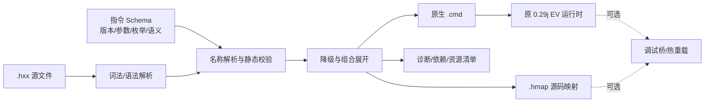

# 哈++（H++）事件语言二次封装方案 v1.0

> 目标运行时：Alice In Cradle 0.29j 事件系统  
> 方案定位：在现有“哈语言”之上增加一层可静态检查、可回退、可渐进迁移的构建期语言，不改变原游戏事件运行时的语义。

## 1. 结论

建议把“哈++”实现成一个**源到源转译器（transpiler）**：作者编写 `.hxx`，编译器生成原生 `.cmd`，游戏仍由 `EvReader → CsvReaderA → EV.readOneLine → listener` 原链路执行。

这是当前最可行的路线，原因有四点：

1. 现有 0.29j 运行时、726 个事件脚本、监听器抢占顺序、等待状态机和资源预扫描无需改动。
2. 旧 `.cmd` 可以与新 `.hxx` 长期共存，迁移可以按文件、模块甚至单行进行。
3. 哈++ 可以在编译期提供命名参数、参数类型、枚举、默认值、结构化条件、组合指令、弃用提示和源码映射，而不把这些复杂度塞进游戏内解释器。
4. 遇到未封装的 602 条长尾命令时，可以通过 `legacy.raw` 无损回退，不阻塞业务。

MVP 不建议直接修改 `EV.readOneLine`、`CsvReaderA` 或所有 `IEventListener`。运行时补丁只保留给后续热重载、断点映射和能力探测，不作为哈++语义成立的前提。

## 2. 事实基线与约束

本方案依据《事件技术文档-LLM 可读版》和历史《指令集.csv》制定，使用以下事实作为硬约束：

- 当前目标版本为 0.29j；事件资源含 726 个 `.cmd`，核心语言与业务监听器合计约 602 条可检索记录。
- `CsvReaderA` 会先处理 token、变量替换、表达式、`IF/ELSE`、`LABEL/GOTO`、花括号和 heredoc，之后普通指令才进入 `EV.readOneLine`。
- 普通指令按监听器注册顺序消费，同名命令可能被更早的监听器截获。因此哈++编译结果必须保留原始行序和命令边界。
- `WAIT`、`WAIT_MOVE`、`WAIT_FN`、`TL/MTL` 等不是同一种等待；哈++不能把它们粗暴归并为一个没有语义区分的 `await`。
- 资源预扫描依赖原指令文本与 `EvtCacheRead`。编译器必须在游戏加载前生成最终 `.cmd`，不能仅在运行时临时改写。
- 历史 CSV 含旧版本增量、重复项和失效说明；它适合提供术语与候选语义，不应被直接当作 0.29j 的唯一真值。

## 3. 设计目标

### 3.1 必须做到

- 生成的 `.cmd` 与手写哈语言在运行时等价。
- 每条哈++指令具有稳定 ID、参数定义、目标版本、降级规则和阻塞语义。
- 编译错误能定位到 `.hxx` 的行列；运行时错误能通过 source map 反查原始行。
- 允许一对一封装、一对多组合和原始指令逃生舱。
- 同一工程可同时放置 `.cmd` 与 `.hxx`。
- 编译器输出可复现：相同输入、配置和目标版本必须产生字节级稳定的 `.cmd`。

### 3.2 明确不做

- v1.0 不重写游戏的事件状态机。
- v1.0 不承诺把全部 602 条命令都包装成高级 API。
- v1.0 不自动猜测资源 ID、角色 ID、任务 ID 是否真实存在；只有接入资源索引后才升级为强校验。
- v1.0 不把帧数隐式改成秒。需要秒单位时，项目必须显式声明 FPS 目标，否则编译报错。
- v1.0 不允许高级组合指令改变底层命令的相对顺序。

## 4. 总体架构



建议拆成五个组件：

| 组件 | 职责 | 是否进入游戏进程 |
| --- | --- | --- |
| `Hpp.Compiler` | 解析、AST、类型检查、降级、稳定输出 | 否 |
| `Hpp.Schema` | 指令注册表、版本范围、枚举、上下文与等待语义 | 否，可共享 |
| `hppc` | CLI：`build/check/format/explain/migrate` | 否 |
| `Hpp.SourceMap` | `.hxx` 行列到 `.cmd` 行的双向映射 | 否 |
| `Hpp.RuntimeBridge` | 可选：热重载、运行时错误反查、能力探测 | 是，第二阶段再做 |

实现语言建议优先 C#：与 Polaris/Unity 插件栈一致，后续复用游戏资源索引和调试桥成本最低。解析器只需支持行式 DSL、命名参数和少量块结构，可以手写 tokenizer + 递归下降解析，不必在 MVP 引入大型编译器框架。

## 5. 哈++语法

### 5.1 文件头与基本调用

```hxx
h.version "1.0"
h.target "0.29j"
h.strict true

dialog.actor actor="n" position="L"
visual.pose target="n" asset="a_1/a22__F1__f1__m1__b1__u0"
dialog.say id="n_01"
time.wait frames=20
```

对应输出：

```text
TALKER n L
PIC n a_1/a22__F1__f1__m1__b1__u0
MSG n_01
WAIT 20
```

规则：

- 指令名统一为小写命名空间形式，如 `dialog.say`、`visual.move`、`event.call`。
- 参数默认使用 `name=value`，字符串用双引号；不会发生变量替换的安全裸标识符可省略引号。
- 哈++变量引用写作 `${name}`，编译到旧语法的 `$name`；原样字符串中的 `$` 不再产生歧义。
- 布尔值统一为 `true/false`，编译器按目标指令转换为 `1/0` 或省略参数。
- 帧数使用整数 `frames`。若未来支持 `2s`，必须在项目配置中锁定时间换算策略。

### 5.2 变量和条件

```hxx
let route = "museum"
calc retry = retry + 1

if retry < 3 {
    event.call id="___city_farm/_rule"
} else {
    ui.alert text="retry_exhausted" style="ALERT_FATAL"
}
```

降级为现有赋值、`IF/ELSE/{}` 和 `CHANGE_EVENT2`。编译器负责：

- 区分字符串赋值与数值表达式；
- 检查未定义变量、同作用域覆盖和明显的恒真/恒假条件；
- 为编译器生成的标签使用保留前缀 `__hpp_`，并拒绝用户手写同前缀标签。

### 5.3 组合指令

哈++允许一个高级指令展开成多条原指令，但展开必须在指令表中可审计。

```hxx
dialog.setup actor="n" position="L" pose="a_1/a22" box="WIDE" from="LT"
visual.transition layer="#9" color="DARK" mode="in" frames=50
```

可能展开为：

```text
TALKER n L
PIC n a_1/a22
HKDS n L LT WIDE
PIC_FILL #9 DARK
PIC_FADEIN #9 50
```

组合指令不应隐藏等待。若展开后含阻塞命令，指令表必须标记 `blocks`，编译器在 `--explain` 中展示完整展开结果。

### 5.4 延迟与等待

保持底层语义分开：

```hxx
time.wait frames=30                    // WAIT 30
input.wait timeout=180                 // WAIT_BUTTON 180
move.wait                              // WAIT_MOVE
task.wait key="MAP_TRANSFER"          // WAIT_FN MAP_TRANSFER
timeline.after frames=15 do="visual.flash layer=#4 delay=15 hold=1 fade=40 color=#cccccc"
message.defer do="visual.hide_all"
```

`timeline.after` 和 `message.defer` 在 v1.0 只接受可编译成**单条原指令**的 `do`。多语句块需要编译器生成模块或明确的运行时队列语义，放到 v1.1，避免错误地假设 `TL/MTL` 支持块。

### 5.5 原始逃生舱

```hxx
legacy.raw "SMNCREATOR TARGET_SCRIPT my_script"
```

约束：

- `legacy.raw` 原样输出一行，并在 source map 中保留对应关系。
- 严格模式下给出 `HPP9001` 警告，但不阻止编译；CI 可配置为错误。
- 原始行仍经过最小安全检查：禁止换行注入、NUL、非法编码和占用 `__hpp_` 标签。

## 6. 指令 Schema

新版指令表不是单纯的“别名表”，而是编译器的公开契约。每条记录至少包含：

- 稳定 ID 与分类；
- 哈++语法和命名参数；
- 编译到的哈语言模板或展开规则；
- 阻塞语义：`none/frame/input/move/wait_fn/message`；
- 支持状态：`stable/experimental/compiler/raw`；
- 最低目标版本；
- 参数与上下文校验规则；
- 示例和兼容说明。

随附的《哈++指令集-v1.0》提供 CSV 与 XLSX 两种格式，共 81 条 v1.0 记录（74 条稳定指令、4 条编译器指令、2 条实验性指令和 1 条原始逃生指令）。CSV 用于版本控制和生成代码；XLSX 用于人工筛选、评审和维护。

### 6.1 Schema 代码生成

建议从 CSV 生成：

- C# `CommandDescriptor` 注册表；
- 文档页与命令速查；
- VS Code 补全数据；
- 参数枚举和弃用规则；
- golden tests 的输入骨架。

CSV 是源数据，但不能在运行时每次解析。构建时应把它生成成不可变 C# 数据或紧凑 JSON，并对 schema 版本做哈希校验。

## 7. 编译流程与诊断

### 7.1 编译阶段

1. 读取 `hpp.toml` 和文件头，确定语言版本、目标游戏版本、严格度与 include 根目录。
2. 解析为 AST，保留每个 token 的文件、行、列。
3. 展开 `h.import`，检测循环引用，并建立模块命名空间。
4. 做变量、标签、参数、枚举、版本和上下文检查。
5. 展开组合指令，生成底层命令 IR；IR 每行都携带来源范围和阻塞语义。
6. 输出 UTF-8 `.cmd`、`.hmap.json` 和诊断报告。
7. 可选执行 round-trip/token 检查，确保生成行能被旧 tokenizer 接受。

### 7.2 推荐诊断码

| 诊断码 | 级别 | 含义 |
| --- | --- | --- |
| `HPP1001` | error | 未知哈++指令 |
| `HPP1002` | error | 缺少必填参数 |
| `HPP1003` | error | 参数类型或枚举非法 |
| `HPP1101` | error | 目标版本不支持该降级目标 |
| `HPP1201` | error | 标签不存在或重复 |
| `HPP1202` | warning | 检测到无出口的显式 GOTO 环 |
| `HPP1301` | warning/error | 资源 ID 未在索引中找到 |
| `HPP1401` | warning | 在非对应上下文调用专用指令 |
| `HPP2001` | warning | 使用实验性封装 |
| `HPP9001` | warning | 使用 `legacy.raw` |

## 8. 与旧哈语言的兼容策略

| 场景 | 处理方式 | 保证 |
| --- | --- | --- |
| 旧 `.cmd` 不迁移 | 原样交给游戏 | 行为不变 |
| 新 `.hxx` 调旧模块 | `module.call` / `event.call` | 生成 `MODULE` / `CHANGE_EVENT2` |
| 新语法缺少封装 | `legacy.raw` | 原始行无损输出 |
| 混合文件 | 不建议在同一物理文件混写；通过 import/call 组合 | 边界清晰 |
| 回滚 | 保留生成的 `.cmd`，停用编译步骤即可 | 不依赖运行时补丁 |
| 目标版本变化 | schema 按 `min/max target` 选择或报错 | 不静默改变语义 |

对旧脚本的自动迁移分三级：

- **L0：格式化但不改写**。只识别 token 和块，不改变指令。
- **L1：安全一对一替换**。例如 `WAIT 30 → time.wait frames=30`、`MSG n_01 → dialog.say id="n_01"`。
- **L2：组合重构建议**。检测 `TALKER + PIC + HKDS` 等序列，只给出可审阅建议，不自动合并。

不建议自动把 `LABEL/GOTO` 改成高级循环或把多个 `TL/MTL` 合并；这类改写很容易改变跳转、队列和跳过行为。

## 9. 项目布局与 CLI

```text
events/
  src/**/*.hxx
  legacy/**/*.cmd
  generated/**/*.cmd
  maps/**/*.hmap.json
  hpp.toml
```

推荐 CLI：

```text
hppc check events/src
hppc build events/src --out events/generated
hppc explain path/event.hxx:42
hppc migrate legacy/foo.cmd --level L1
hppc format events/src
```

`hpp.toml` 示例：

```toml
language = "1.0"
target = "0.29j"
strict = true
encoding = "utf-8"
generated_dir = "events/generated"
source_map_dir = "events/maps"
legacy_raw = "warn"
resource_index = "build/event-resources.json"
```

## 10. 分阶段实施

### 阶段 A：两周可用 MVP

- 建立 schema 读取与代码生成。
- 实现 tokenizer、命名参数、文件头、变量、条件、标签和 40 条最高频封装。
- 支持 `legacy.raw`、稳定 `.cmd` 输出和 `.hmap.json`。
- 建立 30 个 golden fixtures，逐行对比期望 `.cmd`。

验收：能把一组新 `.hxx` 编译后直接放入 `StreamingAssets/evt`，不安装运行时补丁即可执行。

### 阶段 B：两到三周生产化

- 扩展到随附 v1.0 指令集；加入组合指令和版本门控。
- 接入事件资源索引，校验角色、图像、BGM、任务和 UI key。
- 增加 `check/format/explain/migrate L1`。
- 加入旧脚本与生成脚本的差异测试、未知命令扫描和 CI。

验收：选取 5 个真实事件做等价迁移，普通播放、跳过、读档、选择、地图切换和错误日志均与原脚本一致。

### 阶段 C：可选运行时增强

- `Hpp.RuntimeBridge` 读取 source map，把游戏报错映射到 `.hxx`。
- 增加开发环境热重载、断点和能力探测。
- 不改变生产构建对原生 `.cmd` 的依赖。

## 11. 测试策略

### 11.1 编译器测试

- tokenizer：引号、转义、`${var}`、颜色 `#cccccc`、资源路径、空参数。
- schema：缺参、多参、类型、枚举、版本、实验性指令。
- 控制流：嵌套 `if/else`、标签冲突、生成标签稳定性。
- 降级：每条稳定指令至少一组 golden 输入/输出。
- 确定性：不同机器重复构建，输出哈希一致。

### 11.2 游戏内回归

- 对话/立绘：显示、隐藏、跳过、回看日志。
- 时间线：`WAIT`、`TL`、`MTL`、强制 flush/clear。
- 选择与流程：结果变量、取消项、GOTO、嵌套事件返回。
- 地图和 UI：`WAIT_MOVE`、`WAIT_FN`、商店、地图转移。
- 资源：预扫描、BGM、图片、材质加载。
- 存档：中途存档/读档、事件栈恢复、`CHANGE_EVENT2` 返回。

建议建立“原始 `.cmd` 与哈++生成 `.cmd` 双轨回放”样本；对同一事件比较关键 GF/GFC 值、当前事件栈、选择结果和最终地图状态。

## 12. 风险与控制

| 风险 | 后果 | 控制 |
| --- | --- | --- |
| 历史 CSV 含旧语义 | 封装错误 | 以 0.29j 文档/DLL/实际脚本为准；未知项标 experimental |
| 监听器顺序导致同名命令含义变化 | 运行环境差异 | schema 增加 context/capability；保留原命令与顺序 |
| 组合指令隐藏阻塞 | 时序改变 | IR 显式携带 blocking；`explain` 展开；阻塞组合需专项测试 |
| 自动迁移过度 | 旧事件行为变化 | 默认只做 L1 一对一；L2 仅建议 |
| 资源索引不完整 | 假阳性诊断 | 资源检查默认 warning，可按项目升为 error |
| 目标版本升级 | 指令漂移 | schema 版本门控，锁定 target，升级时跑全量 golden 回归 |

## 13. 最小落地决策

若现在开始实现，建议冻结以下决策：

1. 扩展名使用 `.hxx`，编译器命令名使用 `hppc`。
2. v1.0 只做构建期转译，目标固定为 0.29j。
3. 命名参数是主语法；位置参数只允许在 `legacy.raw`。
4. 先覆盖高频、跨项目稳定的通用命令；业务/小游戏长尾保持 raw 或 experimental。
5. CSV schema 为指令元数据源，生成 C# 注册表和编辑器补全。
6. CI 必跑：编译、golden diff、未知指令、source map 完整性和生成文件脏检查。

按此边界，哈++可以在不触碰原运行时的情况下快速提供可读性、可维护性和工具化收益；等真实迁移样本证明稳定后，再决定是否建设运行时调试桥。
