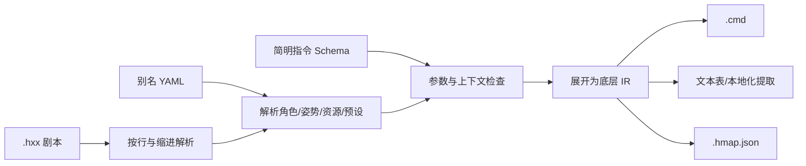

# 哈++ v2.0：NaniScript 风格的低门槛事件语言

> 目标：让剧情作者写“故事和动作”，而不是记忆底层事件参数。  
> 目标运行时：Alice In Cradle 0.29j 原事件系统。  
> 输出方式：`.hxx` 在构建期编译成原生 `.cmd`，不要求修改 EV 解释器。

## 1. 重新设计后的结论

上一版哈++仍然偏 API：`dialog.actor actor=n position=L` 虽然比原指令明确，但作者依旧要理解 actor、position、PIC 和底层资源结构。

v2.0 改成接近 NaniNovel 的**剧本语言**：

```hxx
; 这是注释
@char Noel.Happy pos:left
Noel: 今天也要加油。

@sfx Door
@wait 20

@choice "进去"
    @call FarmRule
@choice "离开"
    @goto #Leave

# Leave
Noel.Sad: 还是回去吧。
```

脚本里不再出现：

```text
a_1/a22__F1__f1__m1__b1__u0
```

它只在资源别名配置中出现一次：

```yaml
actors:
  Noel:
    raw: n
    poses:
      Happy: a_1/a22__F1__f1__m1__b1__u0
```

作者以后只写 `Noel.Happy`。编译器负责解析角色、姿势、位置、对话框和底层图片串，再生成 `TALKER/PIC/HKDS`。

## 2. 参考 NaniNovel 的部分

本方案采用以下成熟设计：

- 一行是一条语句；`@` 表示命令，`#` 表示标签，`;` 表示注释，没有前缀的行是文本。
- 对话可以写成 `角色: 台词`，角色外观可以附在角色名后，例如 `Noel.Happy: 台词`。
- 每条命令最多一个“无名主参数”，如 `@sfx Door`；少用且可选的参数再写成 `time:30`。
- 布尔参数写成 `instant!`、`nowait!`，无需写 `instant:true`。
- 角色外观使用可读的命名姿势，而不是在脚本中展开所有素材参数。
- 选择项可以缩进嵌套执行结果，避免作者手工维护大量标签和 GOTO。
- 变量使用 `{name}` 插入文本；表达式只在 `@set/@if` 等需要逻辑的地方出现。

这里参考的是交互方式，不照搬 Naninovel 运行时。哈++仍然降级到当前哈语言，保留 0.29j 的等待、监听器和事件栈语义。

官方参考：

- https://naninovel.com/guide/scenario-scripting
- https://pre.naninovel.com/guide/characters
- https://naninovel.com/guide/choices
- https://naninovel.com/guide/custom-variables.html
- https://pre.naninovel.com/guide/expressions

## 3. 四种语句

### 3.1 对话和普通文本

```hxx
旁白文本，不写角色。
Noel: 这是角色台词。
Noel.Happy: 说这句话前切换到 Happy 姿势。
Noel: 当前分数是 {score}。
```

编译器把文本转为 0.29j 已支持的 `MSG` heredoc，或在生产模式生成稳定文本 ID 和伴随文本资源。具体输出由项目配置 `textMode` 决定，作者无需管理消息 ID。

推荐规则：

- 短项目使用 `textMode: heredoc`，最直观。
- 需要翻译、配音和稳定引用的项目使用 `textMode: catalog`，编译器根据显式行键生成文本表。
- 可在行尾加稳定键：`Noel: 你好。 #id:greeting_01`。

### 3.2 命令

```hxx
@char Noel.Happy pos:left
@move Noel to:center time:30
@sfx Door
@wait 20
```

语法规则：

```text
@命令 [主参数] [参数名:值] [布尔标记!]
```

- 主参数永远放最前，且每条命令最多一个。
- 常用情形依靠默认值；不要求作者把所有参数写全。
- 参数名使用短词：`pos`、`to`、`time`、`color`、`if`。
- 参数顺序不影响语义。
- 命令和别名大小写不敏感，但格式化器保留注册表中的标准写法。

### 3.3 标签

```hxx
# Retry
@goto #Retry
```

编译为 `LABEL Retry` 和 `GOTO Retry`。编译器检查重复标签和不存在的目标。

### 3.4 注释

```hxx
; 这是给作者看的，不会进入生成结果
```

## 4. 参数简化规则

### 4.1 只让常用值暴露在脚本中

```hxx
@char Noel.Happy pos:left
```

作者看到的只有：

- `Noel`：角色别名；
- `Happy`：该角色的姿势别名；
- `left`：共享位置预设。

配置层负责补足：

- 底层角色 ID `n`；
- 完整 PIC 差分串；
- `TALKER` 位置 `L`；
- `HKDS` 的 position/from/style；
- 默认转场和持续时间。

概念展开：

```text
TALKER n L
PIC n a_1/a22__F1__f1__m1__b1__u0
HKDS n L LT WIDE
```

### 4.2 主参数省略参数名

```hxx
@wait 30
@sfx Door
@voice Noel.Sigh
@call FarmRule
@hide Noel
```

不写成：

```hxx
@wait frames:30
@sfx id:Door
@call event:FarmRule
```

只有第二、第三个低频参数才使用名称：

```hxx
@move Noel to:center time:30
@flash White time:20 delay:5
@shop CityStore pos:center
```

### 4.3 默认值

默认值必须来自注册表或别名配置，不能隐藏在编译器代码中。

| 参数 | 默认值 |
| --- | --- |
| 角色位置 | 角色配置的 `defaultPos`，否则 `center` |
| 对话框样式 | 角色配置的 `box`，否则 `default` |
| 移动曲线 | `smooth`，映射为 `ZLINE` |
| 隐藏方式 | 淡出/移出；`instant!` 才立即消失 |
| 转场图层 | `overlay` |
| 等待 | 保留底层命令原语义；可用 `nowait!` 关闭的命令必须显式登记 |

### 4.4 统一短别名

脚本只能使用以下可读引用：

| 类型 | 例子 | 配置中映射到 |
| --- | --- | --- |
| 角色 | `Noel` | `n` |
| 姿势 | `Noel.Happy` | 完整 PIC 差分串 |
| 表情符号 | `Noel.Sweat` | `SWT` |
| 位置 | `left` | `TALKER L + HKDS L LT` |
| 图片 | `CG.MuseumNight` | PIC 资源名和图层 |
| 音效 | `Door` | `door_open_01` |
| BGM | `Forest` | `BGM_forest` |
| 事件 | `FarmRule` | `___city_farm/_rule` |
| 等待器 | `MapTransfer` | `MAP_TRANSFER` |
| 颜色 | `black` | `BLACK` 或项目色值 |

任何底层值仍可在配置中修改，剧情脚本不跟着变化。

## 5. 资源别名配置

随附 `哈++资源别名配置示例-v2.0.yaml`。建议实际工程拆分为：

```text
events/
  aliases/
    actors.yaml
    visuals.yaml
    audio.yaml
    gameplay.yaml
```

### 5.1 角色与姿势

```yaml
actors:
  Noel:
    raw: n
    display: 诺艾儿
    defaultPos: left
    box: wide
    poses:
      Normal: a_1/a0__F1__f1__m1__b1__u0
      Happy: a_1/a22__F1__f1__m1__b1__u0
      Sad: a_1/a18__F1__f2__m1__b1__u0
```

编译器应验证：

- 同一作用域别名不重复；
- 姿势只能挂在已声明角色下；
- 脚本引用的别名必须存在；
- 可选接入资源扫描器验证 raw 值确实存在；
- 修改 raw 映射时，列出所有受影响脚本但无需改写脚本。

### 5.2 共享位置预设

```yaml
positions:
  left:   { talker: L,  boxPos: L, from: LT }
  center: { talker: C,  boxPos: C, from: T  }
  right:  { talker: R,  boxPos: R, from: RT }
```

作者不需要理解 `L/LT/R/RT` 的底层组合。

### 5.3 可覆盖与局部别名

支持三级作用域：

1. 项目共享别名；
2. 目录别名；
3. 当前文件别名。

解析优先级为“当前文件 > 目录 > 项目”，但覆盖必须给出诊断。生产 CI 建议禁止静默覆盖角色和事件别名，只允许覆盖颜色、位置、时间等表现预设。

## 6. 对话、动作与选择示例

### 6.1 完整短场景

```hxx
; museum/entrance.hxx
@show CG.MuseumNight layer:main
@loadBgm Museum

@char Noel.Normal pos:left
Noel: 这里比白天安静多了。

@char Alma.Smile pos:right
Alma: 要进去看看吗？

@choice "进去"
    @set entered = true
    @sfx Door
    @call MuseumInside

@choice "暂时不去"
    Noel.Sad: 好吧，下次再来。
    @goto #Leave

# Leave
@fade out color:black time:40
@return
```

### 6.2 带条件的选择

```hxx
@choice "打开密门" if:hasKey lock!
    @sfx SecretDoor
    @call SecretRoom

@choice "离开"
    @goto #Leave
```

编译器将缩进块生成内部标签和 GOTO；内部标签统一使用不可手写的 `__hpp_` 前缀。`lock!` 表示条件不满足时显示但不可选；不写 `lock!` 时条件不满足则不生成该选项。

### 6.3 条件块

```hxx
@if score >= 3
    Noel.Happy: 做得不错！
@else
    Noel.Sad: 还需要继续努力。
```

降低到原生 `IF/ELSE/{}`，作者不需要手工写花括号。

## 7. 核心指令面

v2.0 不追求把 602 条底层指令都暴露给作者。核心指令控制在约 50 条：

- 剧情：`@char`、对话行、`@choice`、`@set`、`@if`、`@goto`、`@call`、`@jump`、`@return`。
- 演出：`@show`、`@hide`、`@move`、`@shake`、`@emote`、`@fade`、`@flash`、`@effect`。
- 同步：`@wait`、`@waitInput`、`@waitMove`、`@waitTask`、`@after`、`@afterText`。
- 音频：`@sfx`、`@bgm`、`@voice`、`@vibrate`。
- 游戏：`@flag`、`@number`、`@quest`、`@shop`、`@alert`、`@weather`、`@save`。
- 玩家：`@outfit`、`@cure`、`@key`、`@qte`。
- 兼容：`@raw`。

长尾业务命令有三种处理方式：

1. 已有稳定业务语义：增加一个短的自定义命令；
2. 只在单个项目出现：在别名配置里声明模板命令；
3. 尚未验证：暂时使用 `@raw`，而不是编造高级语义。

详细参数和底层展开见随附《哈++简明指令集-v2.0》。

## 8. 编译器处理流程



IR 不是简单字符串，而应保存：

- 底层指令名和 token；
- 来源文件、行列和缩进块；
- 是否阻塞、等待类型；
- 使用了哪些资源别名；
- 是否由组合指令自动生成。

这样 `hppc explain file.hxx:12` 可以展示：

```text
Noel.Happy
  actor  -> n
  pose   -> a_1/a22__F1__f1__m1__b1__u0
  pos    -> left -> TALKER L / HKDS L LT WIDE
  output -> TALKER n L
            PIC n ...
            HKDS n L LT WIDE
```

复杂值只在 explain、诊断和配置维护时出现，不污染日常剧本。

## 9. 错误提示必须面向作者

错误信息不要只说“参数 2 非法”。示例：

```text
HPP2103 角色 Noel 没有姿势 Hapy。
你是否想写：Noel.Happy？
位置：museum/entrance.hxx:8
```

```text
HPP2201 位置 middle 未定义。
可用位置：left、center、right、offleft、offright。
```

```text
HPP2304 @move 缺少目标位置。
示例：@move Noel to:center time:30
```

建议的诊断类别：

| 代码范围 | 用途 |
| --- | --- |
| `HPP1xxx` | 语法和缩进 |
| `HPP2xxx` | 别名、参数和拼写建议 |
| `HPP3xxx` | 控制流和等待 |
| `HPP4xxx` | 资源存在性和上下文 |
| `HPP9xxx` | `@raw` 与兼容性 |

## 10. 与旧哈语言兼容

- `.hxx` 和旧 `.cmd` 可以共存。
- `@call` 可调用旧模块或事件别名。
- `@raw "原始指令"` 无损输出一行旧哈语言。
- 自动迁移只替换安全形态；遇到复杂 PIC 字符串时，迁移器先把字符串抽进别名表，再在脚本中替换为 `Actor.Pose`。
- 生成 `.cmd` 的行序、事件调用和等待语义必须与旧运行时一致。

推荐迁移流程：

1. 扫描旧脚本中重复出现的 PIC 资源串；
2. 按角色聚类并让美术/剧情人员为姿势命名；
3. 生成 `actors.yaml`；
4. 把 `TALKER + PIC + HKDS + MSG` 序列转换为 `Actor.Pose: 台词`；
5. 对不确定命令保留 `@raw`；
6. 对生成 `.cmd` 做 golden diff 和游戏内回归。

## 11. MVP 实施顺序

### 第一阶段：作者可写

- 四种语句、缩进块、`Actor.Pose` 引用；
- actors/positions/audio/events 别名；
- 对话、角色、等待、音频、流程、选择等约 30 条核心指令；
- `@raw` 与 source map；
- VS Code 补全使用别名表提供角色、姿势和位置候选。

### 第二阶段：迁移可用

- 从旧 `.cmd` 抽取 PIC 串并生成别名候选；
- 识别常见演出序列并给出迁移预览；
- 文本 ID/翻译表生成；
- 真实事件双轨回归。

### 第三阶段：工具完善

- Scene Recorder 风格的位置/姿势可视化选取；
- 运行时错误通过 `.hmap` 映射回 `.hxx`；
- 热重载和断点；
- 业务插件通过 schema 注册自定义短命令。

## 12. v2.0 冻结决策

1. 作者语法采用 `@command main key:value flag!`。
2. 对话采用 `Actor.Pose: text`；纯文本为旁白。
3. 复杂 PIC、音频、事件和等待器标识必须通过别名表进入脚本。
4. 每条命令最多一个无名主参数；常用参数依赖明确默认值。
5. 选择和条件使用缩进块，不要求作者写内部标签、GOTO 或花括号。
6. v2.0 仍是构建期转译器，不改 0.29j 运行时。
7. 无法确定语义的长尾命令使用 `@raw`，不为了“看起来高级”而错误封装。

这版的判断标准很简单：剧情作者正常写作时，只应接触“谁、什么表情、在哪里、说什么、发生什么”，不应接触底层资源串和事件解释器参数。
